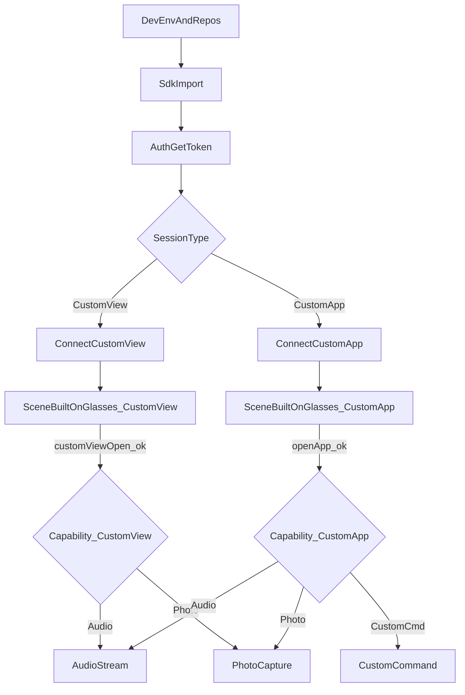
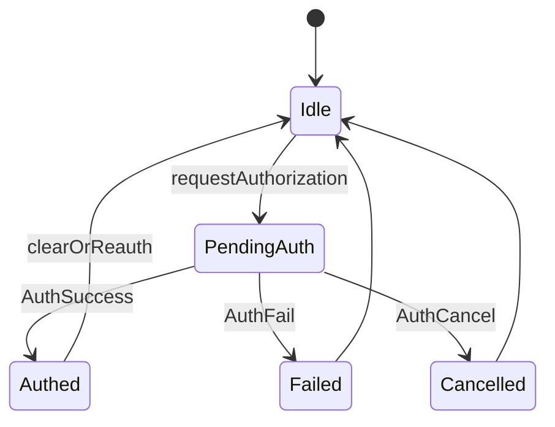
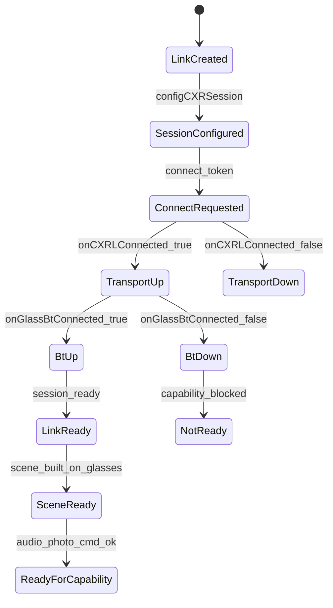
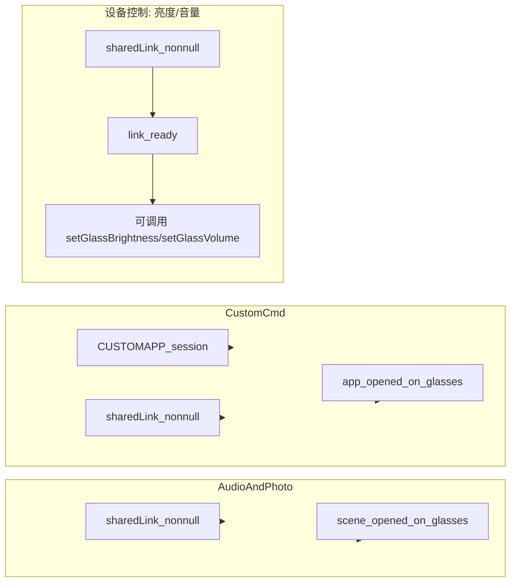
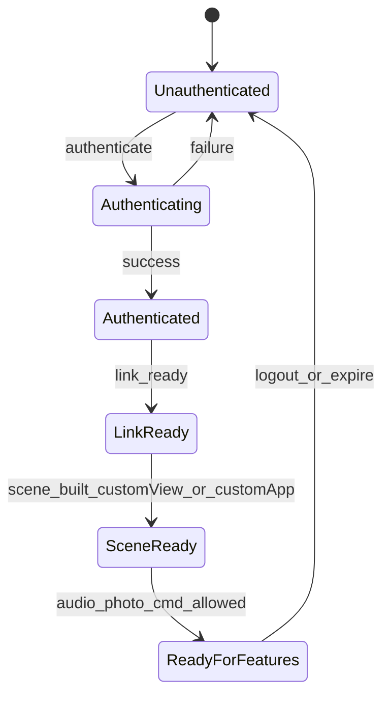
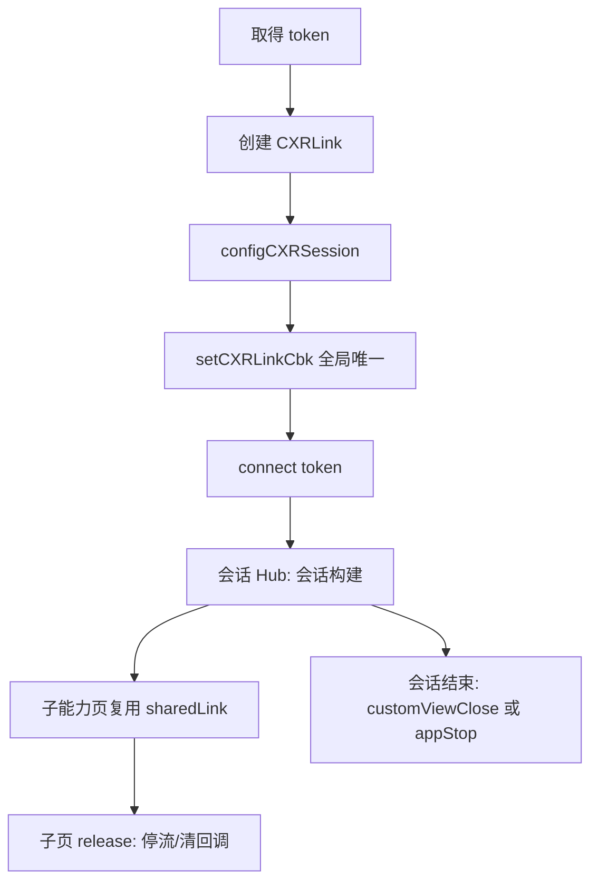
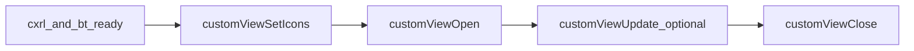
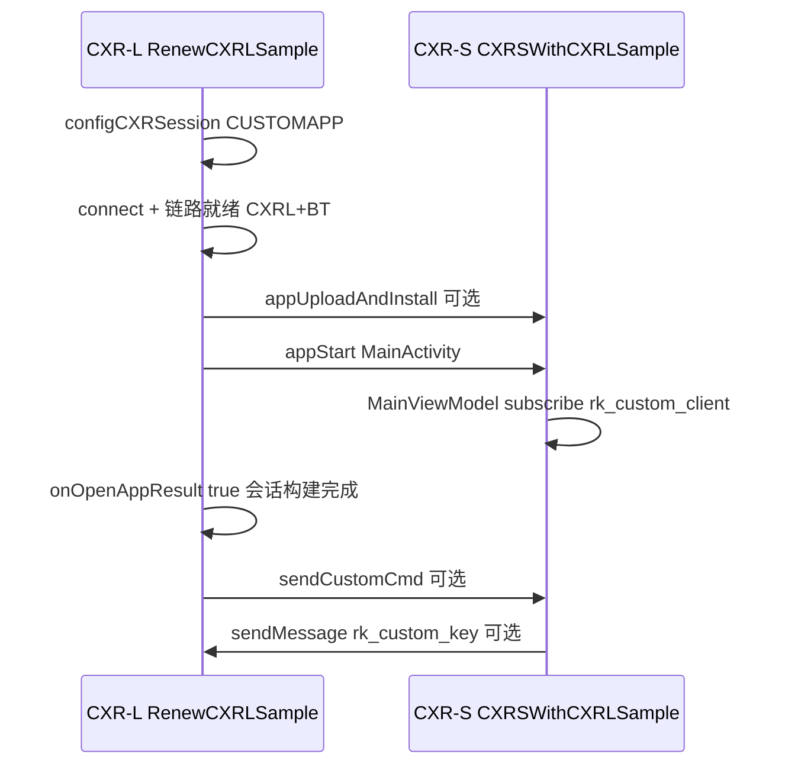

# 1.CXR-L SDK 简介

## 定位

CXR-L SDK 运行在**手机端**，用于与 **Rokid 眼镜**及 **Rokid AI App** 协同，完成鉴权、会话建立以及自定义视图、眼镜端应用控制、音频、拍照、自定义指令等能力。

典型链路：

1. 手机应用集成 SDK，并引导用户安装/唤起 Rokid AI App（或 Hi Rokid）。
2. 通过配套授权流程获取 `token`。
3. 建立 `CustomView` 或 `CustomApp` 会话并保持链路可用。
4. **完成会话构建**：眼镜端已实际呈现目标能力所依赖的界面或应用进程。
5. 在会话就绪后，再使用 **拍照、音频、自定义指令** 等能力。
6. 在链路就绪后，即可使用 **设备控制（亮度/音量）** 能力。

**会话构建（重要）**：指眼镜端已处于业务约定的工作态，而非仅手机侧 `connect` 返回成功。

- **CustomView 会话**：在 `CUSTOMVIEW` 会话下，完成 `customViewOpen` 且收到 `onCustomViewOpened`，眼镜端已展示该自定义界面。
- **CustomApp 会话**：在 `CUSTOMAPP` 会话下，目标包已安装并成功 `appStart`，眼镜端应用处于前台/可交互。

**拍照、音频、自定义指令** 均须在对应会话的 **会话构建完成之后** 再调用。其中 **自定义指令** 仅 CustomApp 会话可用。

**链路就绪**：调用 CustomView / CustomApp 相关 API 前，须 `onCXRLConnected(true)` 且 `onGlassBtConnected(true)`。

## 核心能力

| 能力              | 说明                                                        |
| ----------------- | ----------------------------------------------------------- |
| 连接与会话        | 创建链路实例、配置会话类型、注册状态回调、`connect(token)`  |
| 眼镜端自定义 View | 下发布局 JSON、图标资源；支持打开、更新、关闭               |
| 眼镜端自定义应用  | 查询安装、上传安装 APK、启动、停止、卸载目标包              |
| 自定义指令        | 双向自定义消息（仅 `CUSTOMAPP` 会话）                       |
| 音频              | 开启/停止音频流，接收 PCM 数据                              |
| 拍照              | 指定分辨率与质量触发拍照，接收 JPEG 字节流                  |
| 设备控制          | 设置/查询眼镜亮度（0…15）与音量（0…15）；链路就绪后即可调用 |

## 能力前置关系

| 能力                  | 前置条件                             |
| --------------------- | ------------------------------------ |
| 音频                  | 会话构建完成后；复用全局 `CXRLink`   |
| 拍照                  | 与音频相同                           |
| 自定义指令            | **仅 CustomApp**；且眼镜端应用已打开 |
| 设备控制（亮度/音量） | 链路就绪后即可调用；无需会话构建完成 |

## 能力可用矩阵（摘要）

| 会话 / 状态                       | 音频 | 拍照 | 自定义指令 | 亮度调节 | 音量调节 |
| --------------------------------- | ---- | ---- | ---------- | -------- | -------- |
| 未鉴权 / 无 token                 | 否   | 否   | 否         | 否       | 否       |
| 已鉴权但未 `connect`              | 否   | 否   | 否         | 否       | 否       |
| 已 `connect` 但未完成会话构建     | 否   | 否   | 否         | 是       | 是       |
| `CUSTOMVIEW` 且自定义 View 已打开 | 是   | 是   | 否         | 是       | 是       |
| `CUSTOMAPP` 且眼镜端应用已打开    | 是   | 是   | 是         | 是       | 是       |

## 示例工程

### Android（v1.0.4）

- **工程名**：RenewCXRLSample（`com.rokid.renewcxrlsample`）
- **压缩包**：[`https://rokid-ota.oss-cn-hangzhou.aliyuncs.com/toB/Document/CXR-L/v1.0.4/CXRLSample.zip`](https://rokid-ota.oss-cn-hangzhou.aliyuncs.com/toB/Document/CXR-L/v1.0.4/CXRLSample.zip)
- **SDK 依赖**：`com.rokid.cxr:client-l:1.0.4`
- **必要 App**：Rokid AI App **≥ 1.9.0**（大陆）或 Hi Rokid（海外）
- **架构**：单 Activity 多路由（`CxrSessionActivity`），全局 `CXRLApplication.sharedLink` 复用连接

### iOS（v1.0.4）

- **工程名**：ios_cxr_l_sample
- **压缩包**：[`https://rokid-ota.oss-cn-hangzhou.aliyuncs.com/toB/Document/CXR-L/v1.0.4/ios_cxr_l_sample.zip`](https://rokid-ota.oss-cn-hangzhou.aliyuncs.com/toB/Document/CXR-L/v1.0.4/ios_cxr_l_sample.zip)
- **SDK 依赖**：CocoaPods `RGCxrClient` `1.0.4`

### CXR-S SDK（眼镜端）

**CXR-S SDK**（Maven 构件 `cxr-service-bridge`）用于在 Rokid 眼镜端 Android 应用中接入 CXR 协议，与手机端 CXR-L 协同。手机 App 负责鉴权、会话管理与远程控制；眼镜端 App 负责 CustomApp 业务逻辑，并通过 `Caps` 与手机双向通信。

| 端   | SDK                           | 运行环境            | 职责                                                         |
| ---- | ----------------------------- | ------------------- | ------------------------------------------------------------ |
| 手机 | CXR-L（`client-l`）           | 手机 App            | 鉴权、会话、CustomView 下发、CustomApp 远程控制、音频/拍照/自定义指令 |
| 眼镜 | CXR-S（`cxr-service-bridge`） | 眼镜端 Android 应用 | CustomApp 业务逻辑、`CXRServiceBridge` 与手机 `Caps` 通信    |

- **CustomView 会话**：手机通过 CXR-L 下发布局 JSON；**手机侧 App 无需集成 CXR-S**。
- **CustomApp 会话**：手机通过 CXR-L 安装/启动眼镜端 APK；该 APK **须集成 CXR-S SDK**，包名须与 `CUSTOMAPP` 配置的 `packageName` 一致。

**CXRSWithCXRLSample**（`com.rokid.cxrswithcxrl`）与 RenewCXRLSample 配对联调。本版 Sample **仅演示** CustomApp + 自定义指令 + 按键上报，**不包含** CustomView 渲染、音频、拍照（后续文档扩展）。

| 项            | 值                                                           |
| ------------- | ------------------------------------------------------------ |
| 眼镜端包名    | `com.rokid.cxrswithcxrl`                                     |
| 入口 Activity | `.activities.main.MainActivity`                              |
| SDK 依赖      | `com.rokid.cxr:cxr-service-bridge`（版本以 Sample / 发布说明为准） |
| 压缩包        | [`cxrssample.zip`](https://rokid-ota.oss-cn-hangzhou.aliyuncs.com/toB/Document/CXR-L/v1.0.3/cxrssample.zip) |

相关专章：SDK 导入（眼镜端）、眼镜端自定义应用、自定义指令、按键与系统广播。

# 2.快速开始

## 环境前提

- 真机或可用蓝牙调试环境，已配对/连接目标眼镜。
- 手机已安装 **Rokid AI App**（大陆，版本 **≥ 1.9.0**）或 **Hi Rokid**（海外）。
- 已了解简介中的能力前置关系。

## 获取手机端 Sample

### Android（RenewCXRLSample，v1.0.4）

- **压缩包**：[`https://rokid-ota.oss-cn-hangzhou.aliyuncs.com/toB/Document/CXR-L/v1.0.4/CXRLSample.zip`](https://rokid-ota.oss-cn-hangzhou.aliyuncs.com/toB/Document/CXR-L/v1.0.4/CXRLSample.zip)

### iOS（ios_cxr_l_sample，v1.0.4）

- **压缩包**：[`https://rokid-ota.oss-cn-hangzhou.aliyuncs.com/toB/Document/CXR-L/v1.0.4/iOS/ios_cxr_l_sample.zip`](https://rokid-ota.oss-cn-hangzhou.aliyuncs.com/toB/Document/CXR-L/v1.0.4/iOS/ios_cxr_l_sample.zip)

### 眼镜端（CXRSWithCXRLSample）

- **压缩包**：[`https://rokid-ota.oss-cn-hangzhou.aliyuncs.com/toB/Document/CXR-L/v1.0.4/cxrssample.zip`](https://rokid-ota.oss-cn-hangzhou.aliyuncs.com/toB/Document/CXR-L/v1.0.3/cxrssample.zip)

解压后用 Android Studio 打开 `cxrswithcxrl` 工程，同步 Gradle（需访问 `https://maven.rokid.com/repository/maven-public/`）。包名 `com.rokid.cxrswithcxrl`，与 RenewCXRLSample `CONSTANT` 一致。

## 最小验证路径（Android）

1. 用 Android Studio 打开 RenewCXRLSample，同步 Gradle（需能访问 `https://maven.rokid.com/repository/maven-public/`）。

2. 确认 `app/build.gradle.kts` 中 SDK 依赖为 `com.rokid.cxr:client-l:1.0.4`。

3. 编译安装到手机，确认已安装 **Rokid AI App ≥ 1.9.0**（大陆）或 Hi Rokid（海外）。

4. 在首页完成必要 App 检测与授权，确认拿到 `token`。

5. 选择 **CustomView** 或 **CustomApp** 会话，进入 `CxrSessionActivity`。

6. 等待链路就绪：`onCXRLConnected(true)` **且** `onGlassBtConnected(true)`（两类会话均须满足）。

7. 完成会话构建（眼镜端）

   ：

   - **CustomView**：链路就绪后调用 `customViewSetIcons`（若含图标）与 `customViewOpen`，收到 `onCustomViewOpened`
   - **CustomApp**：确认 APK 已安装（含存储权限校验），调用 `appStart`，收到 `onOpenAppResult(true)`

8. 从 Hub 进入 **音频** / **拍照** 子页验证；**自定义指令** 仅从 **CustomApp** 会话进入。

9. 从 Hub 进入 **设备控制** 子页，拖动滑块调节亮度/音量，验证眼镜端响应。

**重要**：拍照、音频、自定义指令均须在 **会话构建完成之后** 使用。

## CustomApp 联调路径（手机 + 眼镜）

在 **CUSTOMAPP** 会话下验证自定义指令与按键上报：

1. 编译安装眼镜端 CXRSWithCXRLSample（或通过 `appUploadAndInstall` 安装 APK）。
2. 编译安装手机端 RenewCXRLSample，完成授权拿到 `token`。
3. 选择 **CustomApp** 进入 Session Hub，等待链路就绪（CXR + 蓝牙）。
4. 完成会话构建：Hub 内安装/启动 APK，收到 `onOpenAppResult(true)`；眼镜端 `MainViewModel` 内 `subscribe("rk_custom_client", …)` 生效。
5. 进入 **自定义指令** 页：手机 `sendCustomCmd` ↔ 眼镜 `sendMessage`。
6. 在眼镜端按下镜腿键、触控板或返回键，手机端应收到 `rk_custom_key` 回包。

```mermaid
RenewCXRLSampleCXRSWithCXRLSampleCUSTOMAPP 会话 + 链路就绪appStart MainActivitysubscribe rk_custom_clientsendCustomCmd rk_custom_client CapsMsgCallback onReceive UIsendMessage rk_custom_key CapsonCustomCmdResult rk_custom_keyRenewCXRLSampleCXRSWithCXRLSample
```

| 常量               | 值                                  |
| ------------------ | ----------------------------------- |
| `APP_PACKAGE_NAME` | `com.rokid.cxrswithcxrl`            |
| `MAIN_PAGE`        | `.activities.main.MainActivity`     |
| `appStart` 参数    | `"${APP_PACKAGE_NAME}${MAIN_PAGE}"` |

## 最小验证路径（iOS）

1. 按 iOS SDK 导入专章配置 Pod、`Info.plist` 与 URL 回调。
2. 在 `AppDelegate` / `SceneDelegate` 中转发 `CxrClient.shared.handleOpenURL`。
3. 调用 `client.auth.authenticate` 完成鉴权。
4. 建立连接并完成 **眼镜端会话构建**（自定义视图已运行，或自定义应用已按 SDK 要求拉起）。
5. 再验证 **音频、拍照、自定义指令**；顺序与事件订阅见各专章。
6. 从 Hub 进入 **设备控制** 子页，拖动滑块调节亮度/音量，验证眼镜端响应。

**重要**：与 Android 相同，**拍照、音频、自定义指令** 须在会话构建完成之后使用。

## 附录：对照工程模块

| 模块               | 路径（RenewCXRLSample）                                      |
| ------------------ | ------------------------------------------------------------ |
| 首页 / 授权        | `activities/main/`                                           |
| 会话 Hub           | `activities/session/SessionHubViewModel.kt`                  |
| 连接管理           | `link/CxrLinkConnectionHub.kt`、`utils/CxrSessionGate.kt`    |
| 音频 / 拍照 / 指令 | `activities/audio/`、`photo/`、`customCMD/`                  |
| 设备控制           | `activities/device/DeviceControlViewModel.kt`                |
| 全局 CXRLink       | `app/CXRLApplication.kt`                                     |
| APK 权限校验       | `utils/ApkInstallAccess.kt`                                  |
| 眼镜端 Demo        | CXRSWithCXRLSample — `activities/main/`、`receiver/KeyReceiver.kt` |

# 3.开发流程与状态机

## 端到端开发流程



说明：

1. **DevEnv**：手机系统版本（Android minSdk 31+）、蓝牙、Rokid AI App **≥ 1.9.0**、眼镜固件就绪。
2. **SdkImport**：Gradle 引入 `client-l:1.0.4` 与清单配置。
3. **Auth**：通过必要 App 授权，拿到有效 `token`。
4. **Session**：选择 `CUSTOMVIEW` 或 `CUSTOMAPP`，完成 `configCXRSession` 与 `connect`。
5. **SceneBuiltOnGlasses**：眼镜端已打开自定义 View 或已拉起目标应用。
6. **Capability**：音频/拍照两类会话均可用；自定义指令仅 CustomApp。

## Android：鉴权状态



## Android：链路与会话阶段

Hub 典型三阶段：`Connecting` → `SceneNotReady` → `CapabilitiesReady`。



- **链路就绪（CustomView / CustomApp）**：`onCXRLConnected(true)` 且 `onGlassBtConnected(true)`
- **会话构建完成（CustomView）**：`onCustomViewOpened`
- **会话构建完成（CustomApp）**：`onOpenAppResult(true)` 或 `onGlassAppResume(true)`

详述见连接与会话专章。

## Android：能力门控



## 跨平台一致性：能力门控（Android / iOS）

- **音频 / 拍照**：CustomView 与 CustomApp 均可用，但均需链路就绪 + 会话构建完成。
- **自定义指令**：**仅 CustomApp**；CustomView 不可用。
- **设备控制（亮度/音量）**：链路就绪后即可调用；无需会话构建完成。
- 上述规则在 Android 与 iOS 保持一致。

## iOS：鉴权与链路（概念）

- 使用 `client.auth.statePublisher` / `eventPublisher` 观察鉴权状态（详见 iOS 鉴权专章）。
- 使用 `audioEventPublisher`、`customViewRunningEventPublisher` 等观察运行时事件。



具体事件名以 `RGCxrClient` 头文件为准（iOS SDK v1.0.4）。

# 4.术语与缩写

## 平台与产品

| 术语               | 含义                                                         |
| ------------------ | ------------------------------------------------------------ |
| Rokid AI App       | 手机端配套应用（大陆），用于授权与设备协同；包名 `com.rokid.sprite.aiapp`；集成 **client-l:1.0.4** 时须 **≥ 1.9.0** |
| Hi Rokid           | 手机端配套应用（海外）                                       |
| 眼镜 / Glasses     | Rokid 眼镜设备，通过蓝牙等与手机建立链路                     |
| CXR-L SDK          | 手机端 SDK：Android 为 `com.rokid.cxr:client-l:1.0.4`；iOS 为 CocoaPods `RGCxrClient`（v1.0.4） |
| CXR-S SDK          | Glasses-side Android SDK, paired with CXR-L; Maven artifact `cxr-service-bridge`；见 SDK 导入（眼镜端）专章 |
| CXRServiceBridge   | 眼镜端 CXR-S 桥接入口类，`com.rokid.cxr.CXRServiceBridge`；`subscribe` / `sendMessage` 与手机 `sendCustomCmd` / `ICustomCmdCbk` 配对 |
| cxr-service-bridge | CXR-S SDK 的 Maven 坐标前缀，如 `com.rokid.cxr:cxr-service-bridge`（版本以 Sample / 发布说明为准） |

## 鉴权与连接

| 术语        | 含义                                                         |
| ----------- | ------------------------------------------------------------ |
| token       | 鉴权成功后得到的通信令牌，用于 `CXRLink.connect(token)`      |
| CXRLink     | Android SDK 主入口类，`com.rokid.cxr.link.CXRLink`           |
| CxrClient   | iOS SDK 对外入口，`CxrClient.shared`                         |
| ICXRLinkCbk | Android 链路回调：`onCXRLConnected`、`onGlassBtConnected` 等 |

## 会话与链路

| 术语     | 含义                                                         |
| -------- | ------------------------------------------------------------ |
| 链路就绪 | `onCXRLConnected(true)` 且 `onGlassBtConnected(true)`        |
| 会话构建 | 眼镜端已处于业务工作态：CustomView 已打开，或 CustomApp 已启动。音频、拍照、自定义指令均要求会话构建已完成 |
| 会话就绪 | 同「会话构建完成」；CustomView：`onCustomViewOpened`；CustomApp：应用已在眼镜端打开 |

## 会话类型

| 术语            | Android 枚举                        | 说明                                            |
| --------------- | ----------------------------------- | ----------------------------------------------- |
| CustomView 会话 | `CxrDefs.CXRSessionType.CUSTOMVIEW` | 自定义视图 JSON 下发；不携带眼镜端包名          |
| CustomApp 会话  | `CxrDefs.CXRSessionType.CUSTOMAPP`  | 眼镜端 APK 安装/启动/控制；需配置 `packageName` |

iOS 侧通过初始化模式（customView / customApp）区分等价会话，以 `RGCxrClient` 为准。

## 能力缩写

| 缩写                      | 能力                                                         |
| ------------------------- | ------------------------------------------------------------ |
| CustomView                | 眼镜端自定义界面（JSON 布局 + Base64 图标）                  |
| CustomApp                 | 眼镜端 Android 应用远程控制                                  |
| CustomCMD / 自定义指令    | 手机与眼镜应用间自定义二进制消息（`Caps` + `sendCustomCmd`） |
| Caps                      | Rokid 定义的协议，用于手机端 CXR-L 与眼镜端 CXR-S 之间的自定义消息通信 |
| Audio                     | 音频流（`startAudioStream` / `stopAudioStream`）             |
| Photo                     | 远程拍照（`takePhoto` + 图片回调）                           |
| 设备控制 / Device Control | 眼镜亮度（0…15）和音量（0…15）的设置与查询；Android: `setGlassBrightness`/`setGlassVolume`，iOS: `setBrightness`/`setVolume` |

## Caps（Android）

`com.rokid.cxr.Caps`：序列化自定义指令载荷，与 `sendCustomCmd` 配合使用。

## CustomView JSON 术语

| 术语      | 含义                                                         |
| --------- | ------------------------------------------------------------ |
| 视图树    | `customViewOpen` 传入的递归 JSON 结构：`type` + `props` + `children` |
| props.id  | 节点唯一标识，用于 `customViewUpdate` 定位                   |
| 图标 name | `customViewSetIcons` 与 `ImageView.props.name` 的关联键      |

# 功能开发

# Android：SDK 导入

## 概述

在手机 Android 工程中引入 CXR-L 客户端库（`client-l`），配置 Maven 仓库与最低系统版本，使应用能够调用 `CXRLink` 及配套 API。

## 前置条件

- Android Studio，Gradle Kotlin DSL 或 Groovy 均可。
- 设备或模拟器满足 **minSdk 31**（Android 12+）。
- 网络可访问 Rokid Maven 公库。
- 手机已安装 **Rokid AI App ≥ 1.9.0**（大陆）或 **Hi Rokid**（海外），用于鉴权。

## 仓库配置

在工程根目录 `settings.gradle.kts` 的 `dependencyResolutionManagement.repositories` 中加入：

```kotlin
maven { url = uri("https://maven.rokid.com/repository/maven-public/") }
```

同时保留 `google()`、`mavenCentral()` 等常用仓库。

## 依赖声明

在 `app/build.gradle.kts` 的 `dependencies` 中：

```kotlin
implementation("com.rokid.cxr:client-l:1.0.4")
```

## Application 与全局连接

`CXRLink` 实例在会话生命周期内应全局复用。推荐在 `Application` 中持有单例引用，供鉴权后的会话页与子能力页共享：

```kotlin
class MyApplication : Application() {
    var sharedLink: CXRLink? = null

    fun resetSession() {
        sharedLink = null
    }
}
```

在 `AndroidManifest.xml` 注册：

```xml
<application android:name=".MyApplication" ...>
```

**注意**：`namespace` / `applicationId` 为你自有应用包名，与 `CUSTOMAPP` 会话配置的眼镜端目标包名无关。

## 权限与清单（必需）

RenewCXRLSample 与 CXR-L 集成须声明以下权限；按能力裁剪时，**至少保留 `INTERNET`**，CustomApp 安装路径涉及公共存储时须补齐存储相关权限。

| 权限                                          | 必需性                                 | 用途                                    |
| --------------------------------------------- | -------------------------------------- | --------------------------------------- |
| `INTERNET`                                    | **必需**                               | SDK 网络通信                            |
| `MANAGE_MEDIA`                                | 推荐                                   | 媒体/文件访问（Sample 已声明）          |
| `MANAGE_EXTERNAL_STORAGE`                     | CustomApp 读公共目录 APK 时 **必需**   | Android 11+ 访问公共存储中的 `cxrL.apk` |
| `READ_EXTERNAL_STORAGE`（`maxSdkVersion=32`） | Android 12 及以下读外部存储时 **必需** | 读取公共目录 APK                        |

### CustomApp：安装 APK 前的运行时权限

从公共路径（如 `/sdcard/DCIM/Rokid/cxrL.apk`）读取 APK 并调用 `appUploadAndInstall` 前，须：

1. **Android 11+（API 30+）**：引导用户授予「所有文件访问」(`Environment.isExternalStorageManager()`)。
2. **Android 6–12**：请求 `READ_EXTERNAL_STORAGE` 运行时权限。
3. **应用专属目录**（如 `getExternalFilesDir("DCIM/Rokid")`）通常无需上述权限，**推荐优先使用**。

调用 `appUploadAndInstall` 前应确认目标文件 `exists()`、`canRead()`，且公共路径已满足存储权限（Sample 使用 `ApkInstallAccess` 校验）。

若需分享本地文件（如音频 WAV），可配置 `FileProvider`：

```xml
<provider
    android:name="androidx.core.content.FileProvider"
    android:authorities="${applicationId}.fileprovider"
    android:exported="false"
    android:grantUriPermissions="true">
    <meta-data
        android:name="android.support.FILE_PROVIDER_PATHS"
        android:resource="@xml/file_paths" />
</provider>
```

## 同步与验证

1. 执行 Gradle Sync，确认无依赖解析错误。
2. 任意源码文件中可成功 `import com.rokid.cxr.link.CXRLink`。

## 下一步

完成导入后，继续鉴权获取 `token`，再进入连接与会话。

## 附录：对照工程

官方示例工程 RenewCXRLSample（`com.rokid.renewcxrlsample`）可参考 `settings.gradle.kts`、`app/build.gradle.kts` 与 `CXRLApplication.kt`。示例工程内 SDK 版本可能与文档发布版本不同，**集成时以本文 `1.0.4` 为准**。

## 眼镜端：CXR-S SDK 导入

在眼镜端 Android 工程中引入 **CXR-S** 客户端库（Maven 构件 `cxr-service-bridge`），使应用能够调用 `CXRServiceBridge` 及 `Caps` API。手机侧使用上文 `client-l`；**勿在手机 App 中引入 `cxr-service-bridge`**。

### 依赖声明

在眼镜端 `app/build.gradle.kts` 的 `dependencies` 中：

```kotlin
implementation("com.rokid.cxr:cxr-service-bridge:1.0-20260417.063502-103")
```

> **版本说明**：文档以 CXRSWithCXRLSample 快照坐标为例；正式发布版本请以 Sample 工程 `build.gradle.kts` 与发布说明为准。

### AndroidManifest

CXRSWithCXRLSample 清单较为精简：

- 声明入口 `MainActivity`（`android:exported="true"`）。
- **无** CXR 相关额外权限；镜腿/触控板系统广播在运行时通过 `registerReceiver` 注册。

```xml
<application ...>
    <activity
        android:name=".activities.main.MainActivity"
        android:exported="true"
        ...>
        <intent-filter>
            <action android:name="android.intent.action.MAIN" />
            <category android:name="android.intent.category.LAUNCHER" />
        </intent-filter>
    </activity>
</application>
```

### 初始化时机

`CXRServiceBridge` 应在 CustomApp 被手机 `appStart` 拉起后尽早完成：

1. `setStatusListener(StatusListener)` — 监听连接状态。
2. `subscribe(clientKey, MsgCallback)` — 订阅手机下发的自定义指令通道。

详见自定义指令专章。Sample 在 `MainViewModel.init` 中完成上述两步。

### 约束

- `applicationId` 须与手机端 `CUSTOMAPP` 会话配置的 `packageName` 一致。
- SDK 版本须与手机端 `client-l` 及眼镜系统版本兼容，升级时两端同步验证。

### 附录：对照工程

CXRSWithCXRLSample：`app/build.gradle.kts`（`minSdk = 31`、依赖坐标）、`app/src/main/AndroidManifest.xml`。

# Android：鉴权

## 概述

在调用 `CXRLink.connect(token)` 之前，须通过 **Rokid AI App**（大陆）或 **Hi Rokid**（海外）完成 OAuth 式授权，取得通信用的 **token**。授权 UI 由必要 App 承载，业务 App 负责检测安装、发起请求与解析结果。

## 前置条件

- 已完成 SDK 导入。
- 手机已安装 Rokid AI App（**≥ 1.9.0**）或 Hi Rokid（按地区二选一）。

## 核心 API

| 步骤         | API                                                          | 说明                                            |
| ------------ | ------------------------------------------------------------ | ----------------------------------------------- |
| 检测必要 App | `AuthorizationHelper.isRequiredRokidAppInstalled(Activity)`  | 大陆环境是否已安装 Rokid AI App                 |
| 检测必要 App | `AuthorizationHelper.isRequiredHiRokidInstalled(Activity)`   | 海外环境是否已安装 Hi Rokid                     |
| 地区判断     | `AuthorizationHelper.isConnectHiRokid()`                     | 是否连接 Hi Rokid 服务                          |
| 发起授权     | `AuthorizationHelper.requestAuthorization(Activity, permissions, requestCode)` | 打开授权界面；可传入所需 `GlassPermission` 数组 |
| 解析结果     | `AuthorizationHelper.parseAuthorizationResult(resultCode, Intent?)` | 返回 `AuthResult`                               |

### GlassPermission

授权时可预申请眼镜侧运行时权限，例如：

- `GlassPermission.MICROPHONE` — 音频采集
- `GlassPermission.CAMERA` — 拍照

后续可通过 `AuthorizationHelper.hasGlassPermission(GlassPermission.MICROPHONE)` 等方法检查是否已授予对应权限。

`hasGlassPermission` 参数为 `GlassPermission` 枚举值之一，用于检验是否已具备该眼镜侧能力权限。

### AuthResult 分支

| 类型                     | 处理                             |
| ------------------------ | -------------------------------- |
| `AuthResult.AuthSuccess` | 读取 `token`；非空则视为授权成功 |
| `AuthResult.AuthFail`    | 授权失败，清空 token             |
| `AuthResult.AuthCancel`  | 用户取消，清空 token             |

## 集成步骤

### 1. 检测必要 App

```kotlin
when {
    AuthorizationHelper.isRequiredRokidAppInstalled(activity) -> { /* 已安装 Rokid AI */ }
    AuthorizationHelper.isRequiredHiRokidInstalled(activity) -> { /* 已安装 Hi Rokid */ }
    else -> { /* 引导用户安装 */ }
}
```

### 2. 发起授权

```kotlin
private const val AUTH_REQUEST_CODE = 1001

AuthorizationHelper.requestAuthorization(
    activity,
    arrayOf(GlassPermission.MICROPHONE),
    AUTH_REQUEST_CODE
)
```

若用户此前已授权，`requestAuthorization` 可能直接返回 `(resultCode, data)` 元组，此时应立刻调用解析逻辑，无需等待 `onActivityResult`。

### 3. 解析 Activity 回调

```kotlin
override fun onActivityResult(requestCode: Int, resultCode: Int, data: Intent?) {
    super.onActivityResult(requestCode, resultCode, data)
    if (requestCode == AUTH_REQUEST_CODE) {
        val result = AuthorizationHelper.parseAuthorizationResult(resultCode, data)
        when (result) {
            is AuthResult.AuthSuccess -> {
                val token = result.token
                // 保存 token，进入会话建立
            }
            is AuthResult.AuthFail, is AuthResult.AuthCancel -> {
                // 提示用户重新授权
            }
        }
    }
}
```

**重要**：`parseAuthorizationResult` 的第一个参数为 **`resultCode`**（非 `requestCode`），须与当前 SDK 版本保持一致。

## 约束

- 未获得有效 `token` 时，不得假定 `connect` 一定成功。
- 授权流程依赖必要 App，业务 App 不可跳过必要 App 自行伪造 token。
- 集成 **client-l:1.0.4** 时，Rokid AI App 版本须 **≥ 1.9.0**；`AuthorizationHelper.isRequiredRokidAppInstalled` 会校验安装与最低版本。
- token 应在会话建立前持久化或安全传递至会话 Activity。

## 下一步

取得 `token` 后，进入连接与会话创建 `CXRLink` 并调用 `connect(token)`。

## 附录：对照工程

RenewCXRLSample 中 `MainViewModel` 与 `MainActivity` 演示完整授权流程。

# Android：连接与会话

## 概述

创建 `CXRLink`、配置会话类型（`CUSTOMVIEW` 或 `CUSTOMAPP`）、注册链路回调并调用 `connect(token)`，建立手机与眼镜侧的协同会话。同一进程内应复用单一 `CXRLink` 实例，供自定义视图/应用控制及后续的音频、拍照、自定义指令共用。

## 前置条件

- 已完成鉴权，持有非空 `token`。

## 核心类型

| 类型                     | 包路径                                     |
| ------------------------ | ------------------------------------------ |
| `CXRLink`                | `com.rokid.cxr.link.CXRLink`               |
| `CxrDefs.CXRSession`     | `com.rokid.cxr.link.utils.CxrDefs`         |
| `CxrDefs.CXRSessionType` | `CUSTOMVIEW` / `CUSTOMAPP`                 |
| `ICXRLinkCbk`            | `com.rokid.cxr.link.callbacks.ICXRLinkCbk` |

## 会话配置

### CustomView 会话

用于下发自定义视图 JSON，不携带眼镜端目标包名。

```kotlin
val link = CXRLink(context).apply {
    configCXRSession(CxrDefs.CXRSession(CxrDefs.CXRSessionType.CUSTOMVIEW))
    setCXRLinkCbk(linkCallback)
    // CustomView 回调在打开视图前注册，见眼镜端自定义 View 专章
    setCXRCustomViewCbk(customViewCallback)
}
application.sharedLink = link
link.connect(token)
```

### CustomApp 会话

用于远程安装、启动、停止眼镜端 Android 应用，须指定目标包名。

```kotlin
val targetPackage = "com.example.glasses.app"

val link = CXRLink(context).apply {
    configCXRSession(
        CxrDefs.CXRSession(
            CxrDefs.CXRSessionType.CUSTOMAPP,
            targetPackage
        )
    )
    setCXRLinkCbk(linkCallback)
}
application.sharedLink = link
link.connect(token)
```

## 链路回调 ICXRLinkCbk

| 回调                                               | 含义                            |
| -------------------------------------------------- | ------------------------------- |
| `onCXRLConnected(Boolean)`                         | CXR 服务侧连接状态              |
| `onGlassBtConnected(Boolean)`                      | 眼镜蓝牙连接状态                |
| `onGlassAiAssistStart()` / `onGlassAiAssistStop()` | 唤醒词激活/停止                 |
| `onGlassAiInterrupt(Boolean)`                      | AI 打断事件（可用于触发录音等） |
| `onGlassDeviceInfo(GlassInfo)`                     | 眼镜设备信息                    |
| `onGlassWearingStatus(Boolean)`                    | 佩戴检测状态                    |

### 链路就绪判定

**CustomView 与 CustomApp 均须同时满足：**

- `onCXRLConnected(true)` — CXR 服务已连通
- `onGlassBtConnected(true)` — 眼镜蓝牙已就绪

仅 CXRL 连通而蓝牙未就绪时，**不得**调用 `customViewSetIcons`、`customViewOpen`，也不宜调用 CustomApp 安装/启动及子能力 API。RenewCXRLSample 中 `isSessionReady` 与 Hub 的 `_sessionReady` 均按上述合取条件更新。

**链路就绪 ≠ 会话就绪（眼镜端会话构建完成）**。音频、拍照、自定义指令须在 `customViewOpen` 成功或目标应用已启动之后方可调用。

## connect 返回值

`connect(token)` 返回 `Boolean`，表示是否**成功发起**连接请求。最终连通状态以 `ICXRLinkCbk` 回调为准。

## 推荐架构



### 生命周期约定

1. **`setCXRLinkCbk` 进程内只注册一次**，建议集中在 Application 或连接 Hub 单例中。
2. **子能力页（音频/拍照/自定义指令）禁止调用 `disconnect()`**，仅停止本页 SDK 用法（如 `stopAudioStream`、注销 Image/Cmd 回调）。
3. **会话真正结束时**（Activity `isFinishing`）再执行 `customViewClose()` 或 `appStop()`。
4. 在 Hub 与子能力页之间导航时，CustomView / 眼镜端 App **保持打开**。

## 约束

- `configCXRSession` 必须在 `connect` 之前调用。
- 切换会话类型须重新创建 `CXRLink` 并重新配置。
- 避免同一进程内多个 `CXRLink` 实例并行 `connect`，防止状态错乱。

## 下一步

- CustomView 会话 → 眼镜端自定义 View
- CustomApp 会话 → 眼镜端自定义应用

## 附录：对照工程

RenewCXRLSample 中 `CxrSessionGate` 负责创建会话，`CxrLinkConnectionHub` 集中管理 `ICXRLinkCbk`，`SessionHubViewModel` 演示会话构建与能力门控。

# Android：设备控制

## 概述

在链路就绪后，通过 CXRLink 调节眼镜亮度（0…15）和音量（0…15）。亮度/音量控制属于设备级能力，与音频/拍照不同，不需要 CustomView 或 CustomApp 会话构建完成，链路就绪后即可调用。

## 前置条件

- 链路就绪：`onCXRLConnected(true)` 且 `onGlassBtConnected(true)`
- 复用全局 CXRLink 实例（`CXRLApplication.sharedLink`）
- Rokid AI App ≥ 1.9.0（大陆）或 Hi Rokid（海外）

> 与音频/拍照的关键区别：设备控制不要求 CustomView 已打开或 CustomApp 已启动。链路就绪后即可调节亮度/音量。

## 核心 API

| 方法                             | 返回值  | 说明                                                       |
| -------------------------------- | ------- | ---------------------------------------------------------- |
| `setGlassBrightness(level: Int)` | Boolean | 设置亮度，level 范围 0…15                                  |
| `setGlassVolume(level: Int)`     | Boolean | 设置音量，level 范围 0…15                                  |
| `getGlassDeviceInfo()`           | void    | 查询设备信息，结果通过 `onGlassDeviceInfo(GlassInfo)` 回调 |

> 注意：Android SDK v1.0.4 没有独立的 `getBrightness()` / `getVolume()` 方法。读取当前亮度/音量需调用 `getGlassDeviceInfo()`，在 `ICXRLinkCbk.onGlassDeviceInfo(GlassInfo)` 回调中获取 `GlassInfo.brightness` 和 `GlassInfo.sound` 字段。

## GlassInfo 字段

| 字段          | 类型   | 说明             |
| ------------- | ------ | ---------------- |
| brightness    | Int    | 当前亮度（0…15） |
| sound         | Int    | 当前音量（0…15） |
| batteryLevel  | Int    | 当前电量         |
| deviceName    | String | 设备名称         |
| wearingStatus | String | 佩戴状态         |

## 集成示例

```kotlin
// 获取全局 CXRLink 实例
val link = CXRLApplication.sharedLink ?: return

// 设置亮度为 8
val success = link.setGlassBrightness(8)
if (success) {
    // 指令已下发，实际效果以眼镜端表现为准
}

// 设置音量为 10
link.setGlassVolume(10)

// 查询当前设备信息（含亮度/音量）
link.getGlassDeviceInfo()
// 结果在 ICXRLinkCbk.onGlassDeviceInfo(GlassInfo) 中获取
// GlassInfo.brightness → 当前亮度
// GlassInfo.sound → 当前音量
```

## 约束

- level 范围 0…15（含），超出范围的行为未定义
- `setGlassBrightness` / `setGlassVolume` 返回 Boolean 表示指令已下发，不保证眼镜端已执行
- 当前无独立 getter，读取亮度/音量需通过 `getGlassDeviceInfo()` → `onGlassDeviceInfo` 回调
- 链路断开时不应调用设置方法

## 附录：对照工程

RenewCXRLSample 中 `DeviceControlViewModel` 演示亮度/音量设置与查询。

# Android：眼镜端自定义 View

## 概述

在 **CUSTOMVIEW** 会话下，通过手机向眼镜下发 **布局 JSON** 与 **图标资源**（Base64 PNG），在眼镜端渲染界面，并支持 **打开 / 增量更新 / 关闭**。完成后即完成 CustomView 会话的**会话构建**，此后可调用音频、拍照能力。

CustomApp 会话不支持自定义 View API；两者不可混用。

## 前置条件

- 已完成连接与会话配置，`CXRLink` 配置为 `CUSTOMVIEW` 且 `connect(token)` 已调用。
- 已注册 `ICustomViewCbk`。
- 若布局含 `ImageView`，须先通过 `customViewSetIcons` 下发对应图标。

## 核心 API

| 方法                                  | 说明                          |
| ------------------------------------- | ----------------------------- |
| `setCXRCustomViewCbk(ICustomViewCbk)` | 注册自定义视图回调            |
| `customViewSetIcons(String)`          | 传入图标列表 JSON 数组字符串  |
| `customViewOpen(String)`              | 传入完整视图树 JSON，首次打开 |
| `customViewUpdate(String)`            | 传入增量更新 JSON 数组        |
| `customViewClose()`                   | 关闭当前自定义视图            |
| `customViewIsOpen()`                  | 查询视图是否仍处于打开态      |

## 回调 ICustomViewCbk

| 回调                            | 说明                                 |
| ------------------------------- | ------------------------------------ |
| `onCustomViewOpened()`          | 视图已在眼镜端打开；**会话构建完成** |
| `onCustomViewUpdated()`         | 增量更新已应用                       |
| `onCustomViewClosed()`          | 视图已关闭                           |
| `onCustomViewIconsSent()`       | 图标下发成功                         |
| `onCustomViewError(code, msg?)` | 错误；应清除「已打开」状态           |

## 推荐调用顺序



1. **链路就绪**：`onCXRLConnected(true)` 且 `onGlassBtConnected(true)`。
2. 调用 `customViewSetIcons` 下发图标 — 布局含 `ImageView` 时必需；**须在链路就绪后**调用。
3. 调用 `customViewOpen` 下发完整视图树 — **同样须在链路就绪后**调用。
4. 收到 `onCustomViewOpened` 后，可进入音频、拍照等子能力。
5. 需要局部刷新时调用 `customViewUpdate`（建议视图已打开后）。
6. 页面或会话结束时调用 `customViewClose`。

## 约束

- `ImageView` 的 `name` 必须与图标列表中对应项的 `name` 一致。
- 每个节点 `props.id` 唯一，增量更新通过 `id` 定位节点。
- JSON 字段名、单位（`dp` / `sp`）须与协议一致。
- 须在 `onCustomViewOpened` 之后调用音频、拍照。
- `customViewSetIcons` 与 `customViewOpen` 均须在 CXRL 连通且蓝牙就绪后调用。

~~~yaml
## CustomView JSON Schema

### 1. 视图树结构（customViewOpen）

每个节点为 JSON 对象：

```json
{
  "type": "LinearLayout",
  "props": { "id": "root", "layout_width": "match_parent", "layout_height": "match_parent" },
  "children": []
}
~~~

| 字段       | 类型   | 必填 | 说明                                   |
| ---------- | ------ | ---- | -------------------------------------- |
| `type`     | string | 是   | 节点类型，见下表                       |
| `props`    | object | 是   | 节点属性对象                           |
| `children` | array  | 否   | 子节点数组，递归同结构；叶子节点可省略 |

**支持的 `type` 值：**

| type             | 说明                   |
| ---------------- | ---------------------- |
| `LinearLayout`   | 线性布局容器           |
| `RelativeLayout` | 相对布局容器           |
| `TextView`       | 文本                   |
| `ImageView`      | 图片（引用已下发图标） |

### 2. 公共布局字段

以下字段在多种 `type` 的 `props` 中通用：

| 字段              | 类型   | 必填 | 取值 / 格式                               | 说明                                  |
| ----------------- | ------ | ---- | ----------------------------------------- | ------------------------------------- |
| `id`              | string | 是   | `[a-zA-Z0-9_]+`                           | 节点唯一标识，用于 `customViewUpdate` |
| `layout_width`    | string | 是   | `match_parent` | `wrap_content` | `{N}dp` | 宽度                                  |
| `layout_height`   | string | 是   | 同上                                      | 高度                                  |
| `marginStart`     | string | 否   | `{N}dp`                                   | 起始外边距                            |
| `marginEnd`       | string | 否   | `{N}dp`                                   | 结束外边距                            |
| `marginTop`       | string | 否   | `{N}dp`                                   | 上外边距                              |
| `marginBottom`    | string | 否   | `{N}dp`                                   | 下外边距                              |
| `paddingStart`    | string | 否   | `{N}dp`                                   | 起始内边距                            |
| `paddingEnd`      | string | 否   | `{N}dp`                                   | 结束内边距                            |
| `paddingTop`      | string | 否   | `{N}dp`                                   | 上内边距                              |
| `paddingBottom`   | string | 否   | `{N}dp`                                   | 下内边距                              |
| `backgroundColor` | string | 否   | `#RRGGBB` 或 `#AARRGGBB`                  | 背景色；眼镜端按单绿色通道风格渲染    |

> **单位约定**：尺寸值须带 `dp` 或 `sp` 后缀；纯数字在部分客户端可自动补 `dp`，建议始终显式带单位。

> **颜色约定**：传入 `#RRGGBB` 或 `#AARRGGBB`；眼镜端会将色值映射为以绿色为主的显示效果，勿假设全彩还原。

### 3. LinearLayout props

| 字段             | 类型   | 必填 | 取值                                                         | 说明             |
| ---------------- | ------ | ---- | ------------------------------------------------------------ | ---------------- |
| `orientation`    | string | 是   | `vertical` | `horizontal`                                    | 排列方向         |
| `gravity`        | string | 否   | `center` | `center_vertical` | `center_horizontal` | `top` | `bottom` | `start` | `end` | 子元素对齐       |
| `layout_gravity` | string | 否   | 同上                                                         | 在父容器中的对齐 |

LinearLayout 序列化时 `paddingStart` / `paddingEnd` 在 JSON 中对应键名 `paddingLeft` / `paddingRight`。

### 4. RelativeLayout props

除公共布局字段外，还支持相对定位约束：

| 字段                        | 类型   | 必填 | 取值             | 说明                                 |
| --------------------------- | ------ | ---- | ---------------- | ------------------------------------ |
| `layout_toStartOf`          | string | 否   | 目标节点 `id`    | 位于目标起始侧                       |
| `layout_toEndOf`            | string | 否   | 目标节点 `id`    | 位于目标结束侧                       |
| `layout_above`              | string | 否   | 目标节点 `id`    | 位于目标上方                         |
| `layout_below`              | string | 否   | 目标节点 `id`    | 位于目标下方                         |
| `layout_alignStart`         | string | 否   | 目标节点 `id`    | 与目标起始对齐                       |
| `layout_alignEnd`           | string | 否   | 目标节点 `id`    | 与目标结束对齐                       |
| `layout_alignTop`           | string | 否   | 目标节点 `id`    | 与目标顶部对齐                       |
| `layout_alignBottom`        | string | 否   | 目标节点 `id`    | 与目标底部对齐                       |
| `layout_alignBaseLine`      | string | 否   | 目标节点 `id`    | 与目标基线对齐                       |
| `layout_aliginParentStart`  | string | 否   | `true` | `false` | 对齐父容器起始（协议键名保留此拼写） |
| `layout_aliginParentEnd`    | string | 否   | `true` | `false` | 对齐父容器结束                       |
| `layout_aliginParentTop`    | string | 否   | `true` | `false` | 对齐父容器顶部                       |
| `layout_aliginParentBottom` | string | 否   | `true` | `false` | 对齐父容器底部                       |
| `layout_centerInParent`     | string | 否   | `true` | `false` | 在父容器中居中                       |
| `layout_centerHorizontal`   | string | 否   | `true` | `false` | 水平居中                             |
| `layout_centerVertical`     | string | 否   | `true` | `false` | 垂直居中                             |

相对约束中的目标值均为同树内其他节点的 `props.id`。

### 5. TextView props

| 字段        | 类型   | 必填 | 取值                                                         | 说明     |
| ----------- | ------ | ---- | ------------------------------------------------------------ | -------- |
| `text`      | string | 是   | 任意文本                                                     | 显示内容 |
| `textColor` | string | 否   | `#RRGGBB` 或 `#AARRGGBB`                                     | 文字颜色 |
| `textSize`  | string | 否   | `{N}sp`                                                      | 字号     |
| `gravity`   | string | 否   | `center` | `center_vertical` | `center_horizontal` | `start` | `end` | `top` | `bottom` | 文本对齐 |
| `textStyle` | string | 否   | `bold` | `italic` | `bold_italic`                            | 字体样式 |

### 6. ImageView props

| 字段        | 类型   | 必填 | 取值                                                         | 说明                                 |
| ----------- | ------ | ---- | ------------------------------------------------------------ | ------------------------------------ |
| `name`      | string | 是   | 与图标列表 `name` 一致                                       | 引用 `customViewSetIcons` 下发的图标 |
| `scaleType` | string | 否   | `center` | `center_crop` | `center_inside` | `fit_center` | `fit_end` | `fit_start` | `fit_xy` | `matrix` | 缩放模式，默认 `center`              |

### 7. 图标资源（customViewSetIcons）

传入 JSON **数组**字符串：

```json
[
  { "name": "icon1", "data": "<Base64 编码的 PNG>" },
  { "name": "icon2", "data": "<Base64 编码的 PNG>" }
]
```

| 字段   | 类型   | 必填 | 说明                                              |
| ------ | ------ | ---- | ------------------------------------------------- |
| `name` | string | 是   | 图标标识，与 `ImageView.props.name` 对应          |
| `data` | string | 是   | PNG 图片的 Base64 字符串（建议 `Base64.NO_WRAP`） |

### 8. 增量更新（customViewUpdate）

传入 JSON **数组**字符串，每项描述一个节点的变更：

```json
[
  {
    "action": "update",
    "id": "textView",
    "props": {
      "text": "Hello Rokid 1"
    }
  },
  {
    "action": "update",
    "id": "imageView",
    "props": {
      "name": "icon2"
    }
  }
]
```

| 字段     | 类型   | 必填 | 说明                       |
| -------- | ------ | ---- | -------------------------- |
| `action` | string | 是   | 固定为 `"update"`          |
| `id`     | string | 是   | 目标节点 `props.id`        |
| `props`  | object | 是   | 仅包含需要变更的字段键值对 |

单次调用可携带多条更新；切换 `ImageView` 图标时，新 `name` 对应的图标须已通过 `customViewSetIcons` 下发。

### 9. 完整示例

**customViewOpen 示例：**

```json
{
  "type": "LinearLayout",
  "props": {
    "id": "root",
    "layout_width": "match_parent",
    "layout_height": "match_parent",
    "marginTop": "160dp",
    "marginBottom": "80dp",
    "backgroundColor": "#FF000000",
    "orientation": "vertical",
    "gravity": "center_horizontal"
  },
  "children": [
    {
      "type": "TextView",
      "props": {
        "id": "textView",
        "layout_width": "wrap_content",
        "layout_height": "wrap_content",
        "text": "Hello World",
        "textColor": "#00FF00",
        "textSize": "16sp",
        "gravity": "center",
        "textStyle": "bold",
        "paddingStart": "16dp",
        "paddingEnd": "16dp"
      }
    },
    {
      "type": "ImageView",
      "props": {
        "id": "imageView",
        "layout_width": "120dp",
        "layout_height": "120dp",
        "name": "icon1",
        "scaleType": "center"
      }
    }
  ]
}
```

**customViewUpdate 示例：**

```json
[
  {
    "action": "update",
    "id": "textView",
    "props": { "text": "Hello Rokid 1" }
  },
  {
    "action": "update",
    "id": "imageView",
    "props": { "name": "icon2" }
  }
]
```

## 下一步

会话构建完成后，可继续集成音频与拍照。CustomView 会话不支持自定义指令。

## 附录：对照工程

RenewCXRLSample 中 `SessionHubViewModel` 演示打开/更新/关闭流程，`dataBean/selfView/` 目录提供 JSON 构建辅助类。

# Android：眼镜端自定义应用

## 概述

在 **CUSTOMAPP** 会话下，指定眼镜端目标包名，通过 SDK 在眼镜上 **查询安装状态、上传安装 APK、启动 Activity、停止、卸载**。目标应用在眼镜端成功启动并处于可交互态后，即完成 CustomApp 会话的**会话构建**，此后可调用音频、拍照与自定义指令。

## 前置条件

- 已完成连接与会话配置，`configCXRSession` 使用 `CUSTOMAPP` 与正确的 `packageName`。
- 已注册 `IGlassAppCbk` 接收异步结果。

## 核心 API

| 方法                                                 | 说明                                                         |
| ---------------------------------------------------- | ------------------------------------------------------------ |
| `appIsInstalled(IGlassAppCbk)`                       | 查询目标包是否已安装                                         |
| `appUploadAndInstall(apkAbsolutePath, IGlassAppCbk)` | 上传本地 APK 并安装                                          |
| `appStart(entryUriOrComponent, IGlassAppCbk)`        | 启动眼镜端应用；传入 `"${packageName}${activityClassName}"` 形式 |
| `appStop(IGlassAppCbk)`                              | 请求停止应用                                                 |
| `appUninstall(IGlassAppCbk)`                         | 请求卸载                                                     |

## 回调 IGlassAppCbk

| 回调                                     | 说明                                      |
| ---------------------------------------- | ----------------------------------------- |
| `onQueryAppResult(installed: Boolean)`   | 查询安装状态结果                          |
| `onInstallAppResult(success: Boolean)`   | 安装结果                                  |
| `onOpenAppResult(success: Boolean)`      | 启动结果；`true` 表示会话构建成功         |
| `onStopAppResult(success: Boolean)`      | 停止结果                                  |
| `onUnInstallAppResult(success: Boolean)` | 卸载结果                                  |
| `onGlassAppResume(resumed: Boolean)`     | 眼镜端应用前后台切换；`true` 表示恢复前台 |

**会话构建完成**通常以 `onOpenAppResult(true)` 或 `onGlassAppResume(true)` 为准，此后可进入音频、拍照、自定义指令。

## 集成步骤

### 1. 查询安装

```kotlin
link.appIsInstalled(appCallback)
```

### 2. 安装 APK

将 APK 置于应用可读取的路径（推荐应用专属目录，避免 Scoped Storage 限制）：

```kotlin
val apkPath = context.getExternalFilesDir("DCIM/Rokid")!!.resolve("cxrL.apk").absolutePath
link.appUploadAndInstall(apkPath, appCallback)
```

### 3. 启动应用

入口 Activity 须与眼镜端 APK Manifest 一致：

```kotlin
val entry = "${targetPackage}.activities.main.MainActivity"
link.appStart(entry, appCallback)
```

### 4. 停止 / 卸载

```kotlin
link.appStop(appCallback)
link.appUninstall(appCallback)
```

## APK 路径与存储权限

按 Android 版本选择可读路径，优先级示例：

1. `context.getExternalFilesDir("DCIM/Rokid")/cxrL.apk` — **推荐**，通常无需额外存储权限
2. `context.filesDir/cxrL.apk`

若使用公共目录（如 `/sdcard/DCIM/Rokid/cxrL.apk`），须先完成 SDK 导入专章中的存储权限申请，并确认文件 `canRead()` 后再调用 `appUploadAndInstall`。RenewCXRLSample 通过 `ApkInstallAccess` 过滤不可读路径，并在 `CxrSessionActivity` 中引导「所有文件访问」或 `READ_EXTERNAL_STORAGE`。

对 `appUploadAndInstall` 使用 `runCatching` 捕获 `FileNotFoundException` 等 I/O 异常。

## 眼镜端集成（CXR-S）

`CUSTOMAPP` 目标应用运行在眼镜端，须使用 **CXR-S SDK**（`cxr-service-bridge`）构建，与手机端 CXR-L 配对。眼镜端应用不独立鉴权，而是作为手机 **CUSTOMAPP** 会话的目标进程，由 CXR-L 远程安装、启动，并通过同一 CXR 链路上的 `Caps` 通道与手机通信。

SDK 导入见眼镜端（CXR-S）章节；自定义指令见自定义指令专章。

### CUSTOMAPP 配置对齐

| 配置项        | 手机 CXR-L                                                 | 眼镜 CXR-S               |
| ------------- | ---------------------------------------------------------- | ------------------------ |
| 目标包名      | `CUSTOMAPP.packageName`                                    | `applicationId`          |
| 启动入口      | `appStart("${packageName}${activityClass}")`               | Manifest 中对应 Activity |
| Sample 默认值 | `com.rokid.cxrswithcxrl` + `.activities.main.MainActivity` | 同左                     |

手机端 RenewCXRLSample 常量：

```kotlin
val APP_PACKAGE_NAME = "com.rokid.cxrswithcxrl"
val MAIN_PAGE = ".activities.main.MainActivity"
// appStart: "${APP_PACKAGE_NAME}${MAIN_PAGE}"
```

### 启动与会话构建

1. 手机 Hub 调用 `appIsInstalled` / `appUploadAndInstall`（如需）。
2. 链路就绪后调用 `appStart`，注册 `IGlassAppCbk`。
3. `onOpenAppResult(true)` 表示眼镜端 Activity 已启动，**会话构建完成**。
4. 此后可进入音频、拍照、自定义指令。

眼镜端 `MainActivity.onCreate` 中创建 `MainViewModel`，其 `init` 块注册 `CXRServiceBridge` 订阅，即可接收手机指令。



### 桥接初始化

```kotlin
class MainViewModel : ViewModel() {
    private val cxrBridge = CXRServiceBridge()

    init {
        cxrBridge.setStatusListener(connectionCallback)
        cxrBridge.subscribe("rk_custom_client", msgCallback)
    }
}
```

### 约束

- 眼镜端应用由系统/手机远程拉起，勿假设用户从 Launcher 手动打开（Sample 仍保留 Launcher intent-filter 便于独立调试）。
- 升级 APK 后须重新走安装/启动流程，确保桥接订阅在最新进程内注册。
- 手机与眼镜 SDK 版本不匹配可能导致连接或 Caps 解析异常，联调时保持 Sample 同源版本。

## 约束

- `packageName` 与入口 Activity 必须与眼镜端 APK **Manifest 一致**。
- 安装大 APK 时注意蓝牙带宽与超时；业务层可实现重试。
- 自定义指令须复用同一会话的 `CXRLink`，见自定义指令专章。
- 须在应用启动成功（会话构建完成）后再调用音频、拍照、自定义指令。

## 下一步

- 音频 / 拍照 — CustomApp 会话构建完成后可用
- 自定义指令 — 仅 CustomApp 会话
- 眼镜端按键与系统广播 — 按键上报

## 附录：对照工程

RenewCXRLSample 默认目标包名 `com.rokid.cxrswithcxrl`，入口 `.activities.main.MainActivity`，见 `CONSTANT.kt` 与 `SessionHubViewModel`。

# Android：音频

## 概述

在已建立的 `CXRLink` 会话上开启眼镜侧音频流，SDK 通过 `IAudioStreamCbk.onAudioReceived` 回调 **PCM 数据块**。典型规格为 **16 kHz、单声道、16 bit**。

## 前置条件

- 全局 `CXRLink` 已创建且 `connect` 完成。

- 会话构建已完成

  ：

  - CustomView 路径：`customViewOpen` 成功且收到 `onCustomViewOpened`
  - CustomApp 路径：目标应用已通过 `appStart` 启动

- 建议已申请 `GlassPermission.MICROPHONE` 授权。

**不允许**在仅链路连通、会话未就绪时调用 `startAudioStream`。

## 核心 API

| 方法                               | 说明                      |
| ---------------------------------- | ------------------------- |
| `setCXRAudioCbk(IAudioStreamCbk)`  | 注册音频流回调            |
| `startAudioStream(codecType: Int)` | 开始采集；`codecType = 1` |
| `stopAudioStream()`                | 停止采集                  |

`startAudioStream` 返回 `Boolean` 表示是否成功发起，实际流状态以回调为准。

## 回调 IAudioStreamCbk

| 回调                                          | 说明                                  |
| --------------------------------------------- | ------------------------------------- |
| `onAudioReceived(data, offset, length)`       | PCM 片段；注意 `offset`/`length` 边界 |
| `onAudioStreamStateChanged(started: Boolean)` | 流启停状态                            |
| `onAudioError(code, info?)`                   | 错误；应停止采集并提示用户            |

## 集成示例

```kotlin
link.setCXRAudioCbk(object : IAudioStreamCbk {
    override fun onAudioReceived(data: ByteArray?, offset: Int, length: Int) {
        // 写入文件或实时处理；对 offset/length 做越界保护
    }
    override fun onAudioStreamStateChanged(started: Boolean) { }
    override fun onAudioError(code: Int, info: String?) {
        link.stopAudioStream()
    }
})

link.startAudioStream(1)
```

## PCM 参数

| 参数   | 值        |
| ------ | --------- |
| 采样率 | 16000 Hz  |
| 声道   | 1（mono） |
| 位深   | 16 bit    |

若需保存为 WAV，按上述参数写入 WAV 头；时长估算：`pcmBytes / (16000 * 2)` 秒。

## 生命周期

- 子能力页 `onDestroy` 时调用 `stopAudioStream()`，**不要** `disconnect()`。
- 页面销毁前停止采集，避免后台占用。
- 可订阅 `onGlassAiInterrupt` 在 AI 打断时自动开始录音（业务可选）。

## 约束

- 链路断开（`onCXRLConnected(false)` 或 `onGlassBtConnected(false)`）时不应发起推流。
- 高频写盘建议分块 `flush`，结束时 `fd.sync()` 保证落盘。
- CustomView 与 CustomApp 会话均支持音频，但均需先完成会话构建。

## 附录：对照工程

RenewCXRLSample 中 `AudioUsageViewModel` 演示 PCM 采集、WAV 封装与本地播放。

# Android：拍照

## 概述

在已建立的 `CXRLink` 会话上注册图片流回调，调用 `takePhoto(width, height, quality)` 触发眼镜拍照，通过 `IImageStreamCbk.onImageReceived` 接收 **JPEG 压缩字节**并在手机端解码展示或保存。

## 前置条件

- 全局 `CXRLink` 已创建且 `connect` 完成。

- 会话构建已完成

  （与音频专章相同）：

  - CustomView：`onCustomViewOpened` 已触发
  - CustomApp：目标应用已启动

- 建议已申请 `GlassPermission.CAMERA` 授权。

## 核心 API

| 方法                                               | 说明                                   |
| -------------------------------------------------- | -------------------------------------- |
| `setCXRImageCbk(IImageStreamCbk)`                  | 注册图片结果回调                       |
| `takePhoto(width: Int, height: Int, quality: Int)` | 触发拍照；`quality` 为 JPEG 质量 0–100 |

## 回调 IImageStreamCbk

| 回调                                | 说明                                                 |
| ----------------------------------- | ---------------------------------------------------- |
| `onImageReceived(data: ByteArray?)` | JPEG 字节；可用 `BitmapFactory.decodeByteArray` 解码 |
| `onImageError(code, msg?)`          | 拍照失败                                             |

## 集成示例

```kotlin
link.setCXRImageCbk(object : IImageStreamCbk {
    override fun onImageReceived(data: ByteArray?) {
        val bitmap = BitmapFactory.decodeByteArray(data, 0, data?.size ?: 0)
        // 更新 UI 或保存文件
    }
    override fun onImageError(code: Int, msg: String?) {
        // 提示失败
    }
})

link.takePhoto(1024, 768, 80)
```

## 参数建议

| 参数               | 说明                               |
| ------------------ | ---------------------------------- |
| `width` / `height` | 分辨率越高，传输时延与内存占用越大 |
| `quality`          | JPEG 压缩质量；80 为常用折中       |

## 约束

- 建议上一张拍照完成（回调到达）后再发起下一次，避免协议层并发问题。
- 链路断开时不应调用 `takePhoto`。
- CustomView 与 CustomApp 均支持，但均需先完成会话构建。
- 子能力页销毁时注销 Image 回调（可设为空实现），**不要** `disconnect()`。

## 附录：对照工程

RenewCXRLSample 中 `PhotoUsageViewModel` 演示 `takePhoto(1024, 768, 80)` 与 Compose 位图展示。

# Android：自定义指令

## 概述

在 **CUSTOMAPP** 会话与同一 `CXRLink` 实例上，使用 `Caps` 构造载荷，通过 `sendCustomCmd` 向眼镜端发送自定义命令，并在 `ICustomCmdCbk` 中接收回包。用于手机 App 与眼镜端自定义应用之间的双向二进制通信。

**CustomView 会话不支持自定义指令。**

## 双向通道约定

须与眼镜端 `CXRServiceBridge` 及 RenewCXRLSample `CustomCmdViewModel` 保持一致：

| 方向        | 手机 CXR-L                                  | 眼镜 CXR-S                                   |
| ----------- | ------------------------------------------- | -------------------------------------------- |
| 手机 → 眼镜 | `sendCustomCmd("rk_custom_client", Caps)`   | `subscribe("rk_custom_client", MsgCallback)` |
| 眼镜 → 手机 | `onCustomCmdResult("rk_custom_key", bytes)` | `sendMessage("rk_custom_key", Caps)`         |

### Sample Caps 字段（演示）

**手机 → 眼镜**（`sendCustomCmd` 载荷）：

```kotlin
Caps().apply {
    write("rk_custom_key")
    write("from client click times = $count")
}
```

**眼镜 → 手机**（`sendMessage` 载荷）：

```kotlin
Caps().apply {
    write("message")
    write(str)
}
```

## 前置条件

- 会话类型为 `CUSTOMAPP`。
- 全局 `CXRLink` 非空且 `connect` 已完成。
- **会话构建已完成**：眼镜端目标应用已通过 `appStart` 启动并处于可交互态。
- 链路就绪（CXR 连接与蓝牙均可用）。

## 核心 API（手机端）

| 方法                                        | 说明                                   |
| ------------------------------------------- | -------------------------------------- |
| `setCXRCustomCmdCbk(ICustomCmdCbk)`         | 注册自定义指令回调                     |
| `sendCustomCmd(key: String, payload: Caps)` | 发送指令；第二参数直接传入 `Caps` 实例 |

## 回调 ICustomCmdCbk

```kotlin
fun onCustomCmdResult(key: String?, payload: ByteArray?)
```

- `key`：通道标识，须与眼镜端约定一致。
- `payload`：二进制载荷，可用 `Caps.fromBytes(payload)` 反序列化。

## Caps 用法

`com.rokid.cxr.Caps` 用于结构化二进制序列化：

```kotlin
// 发送
link.sendCustomCmd("rk_custom_client", Caps().apply {
    write("rk_custom_key")
    write("message from phone")
})

// 接收
val caps = Caps.fromBytes(payload)
// 按 write 顺序 read 解析
```

手机端与眼镜端须约定：

- 通道 `key`（如 `rk_custom_client`）
- 字段顺序与数据类型
- 最大包长与错误处理

## 集成示例（手机端）

```kotlin
link.setCXRCustomCmdCbk(object : ICustomCmdCbk {
    override fun onCustomCmdResult(key: String?, payload: ByteArray?) {
        if (key == "rk_custom_key" && payload != null) {
            val caps = Caps.fromBytes(payload)
            // 解析并更新 UI
        }
    }
})

link.sendCustomCmd("rk_custom_client", Caps().apply {
    write("rk_custom_key")
    write("hello from client")
})
```

## 约束

- 必须在会话构建完成且链路可用时发送；断链时停止发送。
- 协议版本、字节序、字段语义须与眼镜端应用统一，否则可能静默失败或截断。
- 页面 `onDestroy` 时将 Cmd 回调置为空实现，避免后台误收/误发。
- 须复用创建 CustomApp 会话时的同一 `CXRLink` 实例。

## 眼镜端：CXRServiceBridge

在 **CUSTOMAPP** 会话构建完成后，眼镜端通过 `CXRServiceBridge` 订阅手机下发的指令通道，并用 `sendMessage` 向手机回传数据。

### 前置条件

- 手机端 `appStart` 已成功（`onOpenAppResult(true)`）。
- 眼镜端 `MainViewModel`（或等价模块）已 `subscribe` 约定通道。

### 核心 API

| 方法                                    | 说明                   |
| --------------------------------------- | ---------------------- |
| `setStatusListener(StatusListener)`     | 连接/断开/连接中等状态 |
| `subscribe(name: String, MsgCallback)`  | 订阅手机下发通道       |
| `sendMessage(name: String, caps: Caps)` | 向手机发送回包         |

#### StatusListener（节选）

| 回调             | 说明       |
| ---------------- | ---------- |
| `onConnected`    | 桥接已连接 |
| `onDisconnected` | 桥接断开   |
| `onConnecting`   | 连接中     |

#### MsgCallback

```kotlin
fun onReceive(name: String?, args: Caps?, bytes: ByteArray?)
```

- `name`：与 `subscribe` 的通道名一致时为手机指令。
- `args`：结构化 Caps 载荷（Sample 用于 UI 展示）。
- `bytes`：原始二进制（若协议使用字节流）。

### 集成示例（眼镜端）

```kotlin
class MainViewModel : ViewModel() {
    private val cxrBridge = CXRServiceBridge()
    private val clientKey = "rk_custom_client"
    private val cmdKey = "rk_custom_key"

    private val msgCallback = object : CXRServiceBridge.MsgCallback {
        override fun onReceive(name: String?, args: Caps?, bytes: ByteArray?) {
            // 更新 UI：解析 args
        }
    }

    init {
        cxrBridge.setStatusListener(object : CXRServiceBridge.StatusListener {
            override fun onConnected(p0: String?, p1: String?, p2: Int) {}
            override fun onDisconnected() {}
            override fun onConnecting(p0: String?, p1: String?, p2: Int) {}
            override fun onARTCStatus(p0: Float, p1: Boolean) {}
            override fun onRokidAccountChanged(p0: String?) {}
            override fun onAudioNoise(p0: Float) {}
        })
        cxrBridge.subscribe(clientKey, msgCallback)
    }

    fun sendMessage(text: String) {
        cxrBridge.sendMessage(cmdKey, Caps().apply {
            write("message")
            write(text)
        })
    }
}
```

### Caps 读写

`com.rokid.cxr.Caps` 与 CXR-L 共用类型；接收时按约定顺序读取，Sample 中 `parseCaps` 递归打印类型便于调试。

### 约束

- 通道 `key`、字段顺序与类型须两端统一。
- 须在 `subscribe` 注册后再依赖手机下发；Activity 销毁时考虑取消订阅或释放桥接。
- 断链时勿持续 `sendMessage`；眼镜端无需单独 `connect`。

按键上报通过同一 `sendMessage("rk_custom_key", …)` 通道，见眼镜端按键与系统广播专章。

## 附录：对照工程

| 端   | 类                                                           |
| ---- | ------------------------------------------------------------ |
| 手机 | `CustomCmdViewModel.kt` — `sendCustomCmd`、`onCustomCmdResult` 过滤 `rk_custom_key` |
| 眼镜 | `MainViewModel.kt` — `clientKey` / `cmdKey`、`subscribe`、`sendMessage`、`parseCaps` |

# Android：眼镜端按键与系统广播

## 概述

Rokid 眼镜镜腿键与触控板事件通过 **系统广播** 下发。CXRSWithCXRLSample 在 `MainActivity` 中动态注册 `BroadcastReceiver`，将事件转为字符串后经 `CXRServiceBridge.sendMessage("rk_custom_key", Caps)` 上报手机，与自定义指令共用回传通道。

此外，Activity 的 `onKeyDown` / `onKeyUp` 与 `OnBackPressedCallback` 也会触发 `sendMessage`，便于对比系统广播与 KeyEvent 路径。

## 前置条件

- 已完成 `CXRServiceBridge` 初始化与 `subscribe`（见自定义指令专章）。
- CustomApp 会话已构建，手机端自定义指令页可接收 `rk_custom_key`。

## KeyType 系统广播

`KeyReceiver` 枚举与 action 对照：

| KeyType                           | Action                                                 |
| --------------------------------- | ------------------------------------------------------ |
| `CLICK`                           | `com.android.action.ACTION_SPRITE_BUTTON_CLICK`        |
| `BUTTON_DOWN`                     | `com.android.action.ACTION_SPRITE_BUTTON_DOWN`         |
| `BUTTON_UP`                       | `com.android.action.ACTION_SPRITE_BUTTON_UP`           |
| `DOUBLE_CLICK`                    | `com.android.action.ACTION_SPRITE_BUTTON_DOUBLE_CLICK` |
| `LONG_PRESS`                      | `com.android.action.ACTION_SPRITE_BUTTON_LONG_PRESS`   |
| `AI_START`                        | `com.android.action.ACTION_AI_START`                   |
| `ACTION_TWO_FINGER_SINGLE_TAP`    | `com.android.action.ACTION_TWO_FINGER_SINGLE_TAP`      |
| `ACTION_TWO_FINGER_DOUBLE_TAP`    | `com.android.action.ACTION_TWO_FINGER_DOUBLE_TAP`      |
| `ACTION_TWO_FINGER_SWIPE_FORWARD` | `com.android.action.ACTION_TWO_FINGER_SWIPE_FORWARD`   |
| `ACTION_TWO_FINGER_SWIPE_BACK`    | `com.android.action.ACTION_TWO_FINGER_SWIPE_BACK`      |
| `ACTION_SETTINGS_KEY`             | `com.android.action.ACTION_SETTINGS_KEY`               |

## 动态注册

Sample 在 `MainActivity.onCreate` 注册，`onDestroy` 反注册：

```kotlin
registerReceiver(viewModel.keyReceiver, IntentFilter().apply {
    KeyType.entries.forEach { addAction(it.action) }
})

override fun onDestroy() {
    unregisterReceiver(viewModel.keyReceiver)
    super.onDestroy()
}
```

`KeyReceiver.onReceive` 匹配 action 后调用 `KeyEventListener.onKeyEvent`，并 **`abortBroadcast()`** 避免其他接收器重复处理。

## 与 sendMessage 的关系

```kotlin
// KeyReceiver → MainViewModel
override fun onKeyEvent(keyType: KeyType) {
    sendMessage("Listener: key action = ${keyType.name}")
}

// Activity KeyEvent / 返回键
viewModel.sendMessage("Down keyCode = $keyCode， event = ${event?.action}")
viewModel.sendMessage("Back Pressed")
```

手机端在 `CustomCmdViewModel.onCustomCmdResult("rk_custom_key", …)` 中解析 Caps 并展示。

## 权限说明

- Sample **未**在 Manifest 声明上述 action；依赖眼镜系统向已注册接收器发送有序广播。
- 运行时注册即可，无需 `INTERNET` 等 CXR 以外权限用于按键本身。
- 若自有应用需更高优先级或独占处理，可评估 `abortBroadcast` 与系统其他消费者的兼容性。

## 约束

- 系统广播 action 随系统版本可能扩展，集成时以设备实际行为为准。
- 按键上报频率高时注意 Caps 载荷大小与手机 UI 刷新性能。
- Activity 销毁时必须 `unregisterReceiver`，避免泄漏。

## 附录：对照工程

| 文件                               | 职责                                  |
| ---------------------------------- | ------------------------------------- |
| `receiver/KeyReceiver.kt`          | `KeyType` action 表、`abortBroadcast` |
| `activities/main/MainActivity.kt`  | 动态注册、KeyEvent、返回键            |
| `activities/main/MainViewModel.kt` | `keyReceiver`、`sendMessage`          |

# IOS(暂且略)

# 眼镜端-简介

CXR-S SDK 是运行在 YodaOS-Sprite 上的眼镜端开发工具包，专注于帮助开发者直接在 Rokid Glasses 上创建独立应用。它不仅提供访问眼镜端数据通道的能力，还能与移动端的 CXR-L(CXR-M) SDK 建立双向通信，支持自定义协议和指令传输。通过 CXR-S SDK，开发者可以更深入地调用硬件资源，释放设备潜能，打造低延迟的智能体验。

# 设备连接管理

开发者可以通过Rokid CXR-S SDK实时监测移动端（Android/iOS）设备的连接/断开状态，并且获取 ARTC 数据传输的健康状态。

# 消息通信

开发者可以通过 Rokid CXR-S SDK 订阅移动端发送的指令消息，并且向移动端发送结构化数据（Caps）或二进制流（byte[]）实现双向通信。

# 开发环境

# 打开ADB

使用Rokid CXR-S SDK 时，需要通过Rokid AI APP打开Rokid Glasses 上的adb。


# 使用专用开发线

Rokid Glasses 的磁吸充电口，也可以作为数据口使用。需要使用专门的开发线。

***Tips：默认购买的产品中只有充电线，如果需要开发线，请联系开发者小助理\***

# SDK 导入

**本章节以使用Kotlin DSL（build.gradle.kts）为例**

# 配置Maven 仓库

CXR-S SDK 采用Maven 在线管理SDK Package。

Maven 仓库地址:（“https://maven.rokid.com/repository/maven-public/”）

找到settings.gradle.kts，并在`dependencyResolutionManagement`节点的`repositories` 中添加Maven仓库。


```kotlin
pluginManagement {
    repositories {
        google {
            content {
                includeGroupByRegex("com\\.android.*")
                includeGroupByRegex("com\\.google.*")
                includeGroupByRegex("androidx.*")
            }
        }
        mavenCentral()
        gradlePluginPortal()
    }
}
dependencyResolutionManagement {
    repositoriesMode.set(RepositoriesMode.FAIL_ON_PROJECT_REPOS)
    repositories {
        google()
        maven {
            url = uri("https://maven.rokid.com/repository/maven-public/")
        }
        mavenCentral()
    }
}

rootProject.name = "CXRServiceDemo"
include(":app")
 
```

# 依赖导入

CXR-S SDK Package（“com.rokid.cxr:cxr-service-bridge:1.0-20250519.061355-45”）。

在build.gradle.kts 的`dependencies` 节点中添加依赖。

***注意：SDK 需要设置minSdk≥28\***。

```kotlin
//...Other Settings
android {
    //...Other Settings
    defaultConfig {
        //...Other Settings
        minSdk = 28
    }
   //...Other Settings
    
}
dependencies {
   //...Other Settings
    implementation("com.rokid.cxr:cxr-service-bridge:1.0-20250519.061355-45")
}
```

# 功能开发

# 连接状态

**在阅读本章节前，请注意已明确《SDK 导入》章节内容**

# 监听移动端连接状态

CXR-S SDK 可以通过设置`StatusListener`监听来自移动端的连接状态。

```kotlin
private val TAG = "StatusListener"
private val cxrBridge = CXRServiceBridge()
//  连接状态监听
private val statusListener by lazy {
    object : CXRServiceBridge.StatusListener {
        // 连接成功回调
        override fun onConnected(name: String, type: Int) {    
            Log.d(TAG, "Connected to $name $type")
        }
        // 断开连接回调
        override fun onDisconnected() {
            Log.d(TAG, "Disconnected")
        }
        // ARTC状态更新
        override fun onARTCStatus(health: Float, reset: Boolean) {
            Log.d(TAG, "ARTC Status: Health: ${(health * 100).toInt()}%")
        }
    }
}
fun setStatusListener() {
    cxrBridge.setStatusListener(statusListener)
}
```

**参数说明：**

- `name`: 设备名称
- `type`: 设备类型（1-Android，2-iPhone，3-Unknown）
- `health`: 成功发送的ARTC帧百分比（0.0-1.0）
- `reset`: 是否发生了帧队列重置

# 消息订阅

CXR-S SDK 提供两种消息订阅模式，允许眼镜端应用接收来自移动设备的消息：

1. **普通消息订阅**：单向接收消息
2. **可回复消息订阅**：接收消息并可发送响应

# 1 普通消息订阅

开发者可通过 CXR-S SDK 的 `subscribe(String name, MsgCallback cb)` 方法订阅眼镜端消息。当移动端发送消息时，SDK 会通过 `MsgCallback` 接口的 `onReceive(String name, Caps args, byte[] data)` 回调通知开发者，其中包含消息名称、结构化参数（Caps）及二进制数据（可选）

## 1.1 订阅方法

```kotlin
int subscribe(String name, MsgCallback cb)
```

**参数**：

- `name`：要订阅的消息名称（需与移动端发送的消息名称一致）
- `cb`：消息回调接口实现

**返回值**：

- `0`：订阅成功
- `-1`：参数错误
- `-2`：重复订阅

## 1.2 回调接口

```kotlin
interface MsgCallback {
    void onReceive(String name, Caps args, byte[] value);
}
```

**回调参数**：

- `name`：消息名称
- `args`：消息参数（Caps 格式）
- `value`：附加二进制数据，可能为空

## 1.3 示例代码

```kotlin
 private val cxrBridge = CXRServiceBridge()
//实现回调接口
private val msgCallback = object : CXRServiceBridge.MsgCallback {
    override fun onReceive(name: String, args: Caps, value: ByteArray?) {
       Log.i("MessageSubscribe", "Received name: $name ,args: ${args.size()} , value: ${value} ")
    }
}

//调用subscribe，订阅普通消息
cxrBridge.subscribe("glass_test", msgCallback)
```

# 2 可回复消息订阅

开发者可通过 CXR-S SDK 的 `subscribe(String name, MsgReplyCallback cb)` 方法订阅支持回复的消息。当移动端发送消息时，SDK 将通过 `MsgReplyCallback` 接口的 `onReceive(String name, Caps args, byte[] value, Reply reply)` 回调通知开发者

## 2.1 订阅方法

```kotlin
int subscribe(String name, MsgReplyCallback cb)
```

**参数说明**：

- `name`：要订阅的消息名称（需与移动端约定一致）
- `cb`：实现 `MsgReplyCallback` 接口的实例

**返回值**：

- `0`：订阅成功
- `-1`：参数错误
- `-2`：重复订阅

## 2.2 回调接口

```kotlin
 interface MsgReplyCallback {
    void onReceive(String name, Caps args, byte[] value, Reply reply);
}
```

**回调参数**：

- `name`：消息名称
- `args`：结构化参数（Caps 格式）
- `value`：可选二进制数据，可能为空
- `reply`：用于向移动端发送响应的 Reply 对象

开发者可通过 `reply.end(Caps ret)` 方法返回响应数据

## 2.3 示例代码

```kotlin
private val cxrBridge = CXRServiceBridge()
//实现回调接口
public val replyCallback= object :CXRServiceBridge.MsgReplyCallback {
    override fun onReceive(name: String, args: Caps, value: ByteArray?, reply: Reply?) {
        //接收消息
        Log.d("MessageSubscribe", "Received name: $name ,args: ${args.size()} , value: ${value} ")
        //构造回复消息
        val args = Caps()
        args.write("Received Message and Reply ")
        //回复消息
        reply?.end( args)
    }
}
//调用subscribe，订阅普通消息
cxrBridge.subscribe("glass_test", replyCallback)
```

# 消息发送

CXR-S SDK 提供两种消息发送方法，允许眼镜端应用向连接的移动设备发送数据：

1. **基础消息发送**：发送结构化数据（Caps格式）
2. **二进制消息发送**：发送结构化数据+二进制内容

# 1 基础消息发送

## 1.1 接口定义

```kotlin
int sendMessage(String name, Caps args);
```

**参数说明**：

- `name`：消息名称（需与移动端约定一致）
- `args`：结构化消息参数（Caps对象）

**返回值**：

- `0`：发送成功
- `-1`：参数错误
- `-3`：内部错误

## 1.2 示例代码

```kotlin
//  CXRServiceBridge 已初始化并可用
val cxrServiceBridge = CXRServiceBridge()
 
fun sendExampleMessage() {
    // 1. 创建 Caps 对象并填充数据
    val args = Caps()
    args.write("send_message")  // 写入字符串消息
    args.writeUInt32(5)        // 写入一个无符号32位整数参数（示例值）
 
    // 2. 调用 sendMessage 发送消息（简化版接口）
    val result = cxrServiceBridge.sendMessage(
        "message_channel",  // 消息通道名称（根据实际协议定义）
        args                // 参数对象
    )
 
    // 3. 处理发送结果
    if (result == 0) {
        Log.d("send_message","Send message success")
    } else {
        Log.d("send_message","Send message Error: $result")
    }
}
```

# 2 二进制消息发送

## 2.1 接口定义

```kotlin
int sendMessage(String name, Caps args, byte[] data, int offset, int size);
```

**参数说明**：

- `name`：消息名称（需与移动端约定一致）
- `args`：结构化消息参数（Caps对象）
- `data`：二进制数据数组
- `offset`：数据起始偏移量
- `size`：要发送的数据长度

**返回值**：

- `0`：发送成功
- `-1`：参数错误
- `-3`：内部错误

## 2.2 示例代码

```kotlin
// 假设 CXRServiceBridge 已初始化并可用
val cxrServiceBridge = CXRServiceBridge()

fun sendExampleMessage() {
    // 1. 创建 Caps 对象并填充数据
    val args = Caps()
    args.write("send_message")  // 写入字符串消息
    args.writeUInt32(5)        // 写入一个无符号32位整数参数（示例值）

    // 2. 准备要发送的二进制数据（示例：空数据）
    val data = byteArrayOf()  // 实际场景中替换为需要发送的数据
    val offset = 0            // 数据偏移量
    val size = data.size      // 数据大小
     
    // 3. 调用 sendMessage 发送数据
    val result = cxrServiceBridge.sendMessage(
        "message_channel",  // 消息通道名称（根据实际协议定义）
        args,               // 参数对象
        data,               // 二进制数据
        offset,           // 数据起始偏移量
        size                // 数据长度
    )
     
    // 4. 处理发送结果
    if (result == 0) { 
        Log.d("send_message","Send message success")
    } else {
        Log.d("send_message","Send message Error: $result")
    }
}
```

数据结构


# Caps 数据结构

`Caps` 类是一个用于序列化和反序列化结构化数据的工具类，支持多种基本数据类型和嵌套对象。它通过链表存储数据值，并提供类型安全的访问方法。

## 主要功能

- 支持多种数据类型：布尔值、整数、浮点数、字符串、二进制数据等
- 提供序列化和反序列化功能
- 提供类型安全的访问方法

## 数据写入方法

| 方法签名                                          | 描述                            |
| ------------------------------------------------- | ------------------------------- |
| `void write(boolean v)`                           | 写入布尔值（内部转换为 uint32） |
| `void writeInt32(int v)`                          | 写入 32 位有符号整数            |
| `void writeUInt32(int v)`                         | 写入 32 位无符号整数            |
| `void writeInt64(long v)`                         | 写入 64 位有符号整数            |
| `void write(float v)`                             | 写入单精度浮点数                |
| `void write(double v)`                            | 写入双精度浮点数                |
| `void write(String v)`                            | 写入字符串                      |
| `void write(byte[] data)`                         | 写入字节数组                    |
| `void write(Caps obj)`                            | 写入嵌套的 Caps 对象            |
| `void write(byte[] data, int offset, int length)` | 写入字节数组的指定部分          |

## 数据访问方法

| 方法签名            | 描述                        |
| ------------------- | --------------------------- |
| `int size()`        | 返回存储的值数量            |
| `Value at(int idx)` | 获取指定索引处的 Value 对象 |
| `void clear()`      | 清空所有存储的值            |

## 序列化/反序列化

| 方法签名                                                     | 描述                                     |
| ------------------------------------------------------------ | ---------------------------------------- |
| `byte[] serialize()`                                         | 序列化当前数据为字节数组（native 方法）  |
| `boolean parse(byte[] input, int offset, int length)`        | 从字节数组反序列化数据（native 方法）    |
| `static Caps fromBytes(byte[] input, int offset, int length)` | 从字节数组创建 Caps 对象                 |
| `static Caps fromBytes(byte[] input)`                        | 从字节数组创建 Caps 对象（使用完整数组） |

## 使用示例

### 写入示例

```kotlin
// 1. 创建 Caps 对象并填充数据
val args = Caps()
caps.write("sendmessage");      // 写入字符串
caps.writeUInt32(5);            // 写入无符号32位整数
caps.write(true);               // 写入布尔值
caps.write(3.14f);              // 写入浮点数
```

### 读取数据示例

```kotlin
 private fun parseCapsValue(value: Caps.Value): String {
        return when (value.type()) {
            Caps.Value.TYPE_STRING -> "String: ${value.getString()}"
            Caps.Value.TYPE_INT32 -> "Int32: ${value.getInt()}"
            Caps.Value.TYPE_UINT32 -> "UInt32: ${value.getInt()}"
            Caps.Value.TYPE_INT64 -> "Int64: ${value.getLong()}"
            Caps.Value.TYPE_UINT64 -> "UInt64: ${value.getLong()}"
            Caps.Value.TYPE_FLOAT -> "Float: ${value.getFloat()}"
            Caps.Value.TYPE_DOUBLE -> "Double: ${value.getDouble()}"
            Caps.Value.TYPE_BINARY -> "Binary: ${value.getBinary().length} bytes"
            Caps.Value.TYPE_OBJECT -> "Caps Object"

            // 其他类型解析...
            else -> "Unsupported type"
        }
    }
```

# 按键

# Rokid Glasse 上的系统功能按键

在Rokid Glasses 上，可以通过监听有序广播来截止按键的系统事件触发。

## 1 按键广播

具体的按键广播信息参考如下：

```kotlin
package com.rokid.cxrssdksamples.activities.keys

import android.content.BroadcastReceiver
import android.content.Context
import android.content.Intent

interface KeyReceiverListener {
    fun onReceive(keyType: KeyType)
}

enum class KeyType(val action: String) {
    CLICK("com.android.action.ACTION_SPRITE_BUTTON_CLICK"),
    BUTTON_DOWN("com.android.action.ACTION_SPRITE_BUTTON_DOWN"),
    BUTTON_UP("com.android.action.ACTION_SPRITE_BUTTON_UP"),
    DOUBLE_CLICK("com.android.action.ACTION_SPRITE_BUTTON_DOUBLE_CLICK"),
    AI_START("com.android.action.ACTION_AI_START"),
    LONG_PRESS("com.android.action.ACTION_SPRITE_BUTTON_LONG_PRESS"),
    ACTION_TWO_FINGER_SINGLE_TAP("com.android.action.ACTION_TWO_FINGER_SINGLE_TAP"),
    ACTION_TWO_FINGER_DOUBLE_TAP("com.android.action.ACTION_TWO_FINGER_DOUBLE_TAP"),
    ACTION_TWO_FINGER_SWIPE_FORWARD("com.android.action.ACTION_TWO_FINGER_SWIPE_FORWARD"),
    ACTION_TWO_FINGER_SWIPE_BACK("com.android.action.ACTION_TWO_FINGER_SWIPE_BACK"),
    ACTION_SETTINGS_KEY("com.android.action.ACTION_SETTINGS_KEY")
}

class KeyReceiver : BroadcastReceiver() {

    var listener: KeyReceiverListener? = null

    override fun onReceive(context: Context?, intent: Intent?) {
        intent?.action?.let {
            when (it) {
                KeyType.CLICK.action -> {
                    // 接收到了按键点击--截止广播
                    listener?.onReceive(KeyType.CLICK)
                    abortBroadcast()
                }
                KeyType.BUTTON_DOWN.action -> {
                    // 监听按键按下--截止广播
                    listener?.onReceive(KeyType.BUTTON_DOWN)
                    abortBroadcast()
                }
                KeyType.BUTTON_UP.action -> {
                    // 监听按键抬起--截止广播
                    listener?.onReceive(KeyType.BUTTON_UP)
                    abortBroadcast()
                }
                KeyType.DOUBLE_CLICK.action -> {
                    // 监听按键双击--截止广播--不可截断--该事件为退出
                    listener?.onReceive(KeyType.DOUBLE_CLICK)
                    abortBroadcast()
                }
                KeyType.AI_START.action -> {
                    // 监听AI开始--截止广播
                    listener?.onReceive(KeyType.AI_START)
                    abortBroadcast()
                }
                KeyType.LONG_PRESS.action -> {
                    // 监听按键长按--截止广播
                    listener?.onReceive(KeyType.LONG_PRESS)
                    abortBroadcast()
                }
                KeyType.ACTION_TWO_FINGER_SINGLE_TAP.action -> {
                    // 监听按键双指单机--截止广播
                    listener?.onReceive(KeyType.ACTION_TWO_FINGER_SINGLE_TAP)
                    abortBroadcast()
                }
                KeyType.ACTION_TWO_FINGER_DOUBLE_TAP.action -> {
                    // 监听按键双击--截止广播
                    listener?.onReceive(KeyType.ACTION_TWO_FINGER_DOUBLE_TAP)
                    abortBroadcast()
                }
                KeyType.ACTION_TWO_FINGER_SWIPE_FORWARD.action -> {
                    // 监听按键双击--截止广播
                    listener?.onReceive(KeyType.ACTION_TWO_FINGER_SWIPE_FORWARD)
                    abortBroadcast()
                }
                KeyType.ACTION_TWO_FINGER_SWIPE_BACK.action -> {
                    // 监听按键双击--截止广播
                    listener?.onReceive(KeyType.ACTION_TWO_FINGER_SWIPE_BACK)
                    abortBroadcast()
                }
                KeyType.ACTION_SETTINGS_KEY.action -> {
                    // 监听按键双击--截止广播
                    listener?.onReceive(KeyType.ACTION_SETTINGS_KEY)
                    abortBroadcast()
                }
            }
        }
    }
}
```

## 2 按键广播的使用

参考如下代码：

```kotlin
private val keyReceiver = KeyReceiver().apply {
    listener = object : KeyReceiverListener {
        override fun onReceive(keyType: KeyType) {
            // 更新状态以在UI中显示最新的按键类型
            latestKeyType = keyType

            when (keyType) {
                KeyType.CLICK -> {
                    // 处理按键点击事件
                    Log.d("KeysActivity", "system event: button on left leg")
                }
                KeyType.BUTTON_DOWN -> {
                    // 处理按键按下事件
                    Log.d("KeysActivity", "system event: button on left leg down")
                }
                KeyType.BUTTON_UP -> {
                    // 处理按键抬起事件
                    Log.d("KeysActivity", "system event: button on left leg up")
                }
                KeyType.DOUBLE_CLICK -> {
                    // 处理按键双击事件
                    Log.d("KeysActivity", "system event: button on left leg double click")
                }
                KeyType.AI_START -> {
                    // 处理touchpad 长按事件
                    Log.d("KeysActivity", "system event: touchpad long pressed")
                }
                KeyType.LONG_PRESS -> {
                    // 处理按键长按事件
                    Log.d("KeysActivity", "system event: long pressed the button on left leg")
                }

                KeyType.ACTION_TWO_FINGER_SINGLE_TAP -> {
                    // 处理双指单击事件
                    Log.d("KeysActivity", "system event: two finger single tap")
                }
                KeyType.ACTION_TWO_FINGER_DOUBLE_TAP -> {
                    // 处理双指双击事件
                    Log.d("KeysActivity", "system event: two finger double tap")
                }
                KeyType.ACTION_TWO_FINGER_SWIPE_FORWARD -> {
                    // 处理双指滑动事件
                    Log.d("KeysActivity", "system event: two finger swipe forward")
                }
                KeyType.ACTION_TWO_FINGER_SWIPE_BACK -> {
                    // 处理双指滑动事件
                    Log.d("KeysActivity", "system event: two finger swipe back")
                }
                KeyType.ACTION_SETTINGS_KEY -> {
                    // 处理双指长按事件
                    Log.d("KeysActivity", "system event: two finger long pressed")
                }
            }
        }
    }
}
@SuppressLint("UnspecifiedRegisterReceiverFlag")
override fun onCreate(savedInstanceState: Bundle?) {
    super.onCreate(savedInstanceState)
    enableEdgeToEdge()

    // 设置屏幕常亮
    window.addFlags(android.view.WindowManager.LayoutParams.FLAG_KEEP_SCREEN_ON)

    setContent {
        CXRSSDKSamplesTheme {
            KeysScreen(latestKeyType = latestKeyType?.name ?: "")
        }
    }
    registerReceiver(keyReceiver, IntentFilter().apply {
        addAction(KeyType.CLICK.action)
        addAction(KeyType.BUTTON_DOWN.action)
        addAction(KeyType.BUTTON_UP.action)
        addAction(KeyType.DOUBLE_CLICK.action)
        addAction(KeyType.AI_START.action)
        addAction(KeyType.LONG_PRESS.action)
        addAction(KeyType.ACTION_TWO_FINGER_SINGLE_TAP.action)
        addAction(KeyType.ACTION_TWO_FINGER_DOUBLE_TAP.action)
        addAction(KeyType.ACTION_TWO_FINGER_SWIPE_FORWARD.action)
        addAction(KeyType.ACTION_TWO_FINGER_SWIPE_BACK.action)
        addAction(KeyType.ACTION_SETTINGS_KEY.action)
        priority = 100
    })
}
```

# 其他按键

其他的按键信息都可以通过监听系统keyEvent 来监听。

```kotlin
@SuppressLint("GestureBackNavigation")
override fun onKeyDown(keyCode: Int, event: KeyEvent?): Boolean {
    Log.d("KeysActivity", "onKeyDown: $keyCode")
    when (keyCode) {
        KeyEvent.KEYCODE_BACK -> {
            // 拦截返回键
            Log.d("KeysActivity", "onKeyDown: back pressed")
            return true
        }
        KeyEvent.KEYCODE_ENTER->{
            Log.d("KeysActivity", "onKeyUp: touchpad single down")
            return  true
        }
        else -> {
            Log.d("KeysActivity", "onKeyUp: $keyCode")
        }
    }
    return super.onKeyDown(keyCode, event)
}

@SuppressLint("GestureBackNavigation")
override fun onKeyUp(keyCode: Int, event: KeyEvent?): Boolean {
    Log.d("KeysActivity", "onKeyUp: $keyCode")
    when (keyCode) {
        KeyEvent.KEYCODE_BACK -> {
            // 拦截返回键
            Log.d("KeysActivity", "onKeyUp: back pressed")
            return true
        }
        KeyEvent.KEYCODE_ENTER->{
            Log.d("KeysActivity", "onKeyUp: touchpad single up")
            return  true
        }
        else -> {
            Log.d("KeysActivity", "onKeyUp: $keyCode")
        }
    }
    return super.onKeyUp(keyCode, event)
}
```

# 录音说明

# Rokid Glasses 上的录音

Rokid Glasses 上提供了一个8通道的录音配置，开发者可以通过设置Audio Channel 来获取这8通道的音频。

其中

- 通过0/1 是算法后的音频
- 2/3/4/5 为Rokid Glasses 上的4 路麦克风的原始音频。
- 6/7 为硬件回声

参考：

```kotlin
package com.rokid.cxrssdksamples.activities.audioRecord

import android.Manifest
import android.annotation.SuppressLint
import android.app.Activity
import android.content.IntentFilter
import android.media.AudioFormat
import android.media.AudioRecord
import android.media.MediaRecorder
import android.os.Environment
import android.util.Log
import androidx.annotation.RequiresPermission
import androidx.lifecycle.MutableLiveData
import androidx.lifecycle.ViewModel
import com.rokid.cxrssdksamples.activities.keys.KeyReceiver
import com.rokid.cxrssdksamples.activities.keys.KeyReceiverListener
import com.rokid.cxrssdksamples.activities.keys.KeyType
import com.rokid.cxrssdksamples.default.CONSTANT
import kotlinx.coroutines.flow.MutableStateFlow
import kotlinx.coroutines.flow.asStateFlow
import java.io.File
import java.io.FileOutputStream
import java.text.SimpleDateFormat
import java.util.Date
import java.util.Locale

interface PermissionNeed{
    fun needPermission()
}

@SuppressLint("MissingPermission")
class AudioRecordViewModel : ViewModel() {
    private val _isRecording = MutableStateFlow(false)
    val isRecording = _isRecording.asStateFlow()
    private val _isPreparing = MutableStateFlow(false)
    val isPreparing = _isPreparing.asStateFlow()

    var permissionNeed: PermissionNeed? = null

    private var keyReceiver: KeyReceiver = KeyReceiver().apply {
        listener = object : KeyReceiverListener {
            override fun onReceive(keyType: KeyType) {
                // 更新状态以在UI中显示最新的按键类型
                when (keyType) {
                    KeyType.CLICK -> {// 点击
                        Log.e("AudioRecordActivity", "点击")
                        if (!permissionGranted.value) {

                            permissionNeed?.needPermission()
                        }else{
                            // 停止录音
                            if (_isRecording.value) {
                                _isRecording.value = false
                                stopRecording()
                            }else{
                                _isRecording.value = true
                                startAudioRecord()
                            }
                        }
                    }

                    KeyType.BUTTON_DOWN -> {
                        Log.e("AudioRecordActivity", "按下")

                    }

                    KeyType.BUTTON_UP -> {
                        Log.e("AudioRecordActivity", "抬起")
                    }

                    KeyType.DOUBLE_CLICK -> {
                        Log.e("AudioRecordActivity", "双击")
                    }

                    KeyType.AI_START -> {
                        Log.e("AudioRecordActivity", "AI开始")
                    }
                    KeyType.LONG_PRESS -> {
                        Log.e("AudioRecordActivity", "长按")
                    }
                    else -> {
                        Log.e("AudioRecordActivity", "其他按键")
                    }
                }
            }
        }
    }

    private var recorder: AudioRecord? = null
    private var recordingThread: Thread? = null
    private var isRecordingActive = false

    private val _permissionGranted = MutableStateFlow(false)
    val permissionGranted = _permissionGranted.asStateFlow()

    companion object {
        private const val SAMPLE_RATE = 16000 // 16kHz
        private const val CHANNEL_CONFIG = CONSTANT.AUDIO_CHANNEL
        private const val AUDIO_FORMAT = AudioFormat.ENCODING_PCM_16BIT // 16-bit
        private const val BUFFER_SIZE = 1024
    }

    @SuppressLint("UnspecifiedRegisterReceiverFlag")
    fun registerReceiver(activity: Activity) {
        activity.registerReceiver(keyReceiver, IntentFilter().apply {
            addAction(KeyType.CLICK.action)
            addAction(KeyType.BUTTON_DOWN.action)
            addAction(KeyType.BUTTON_UP.action)
            addAction(KeyType.DOUBLE_CLICK.action)
            addAction(KeyType.AI_START.action)
            addAction(KeyType.LONG_PRESS.action)
            priority = 100
        })
    }

    fun unregisterReceiver(activity: Activity) {
        keyReceiver?.let {
            activity.unregisterReceiver(it)
        }
    }

    fun permissionGranted(granted: Boolean) {
        _permissionGranted.value = granted
    }

    fun stopRecording() {
        isRecordingActive = false
        recordingThread?.join()
        recorder?.stop()
        recorder?.release()
        recorder = null
    }

    fun startAudioRecord() {
        if (recorder == null) {
//            val bufferSize = AudioRecord.getMinBufferSize(
//                SAMPLE_RATE,
//                CHANNEL_CONFIG,
//                AUDIO_FORMAT
//            )
            
            recorder = AudioRecord.Builder()
                .setAudioSource(MediaRecorder.AudioSource.MIC)
                .setAudioFormat(
                    AudioFormat.Builder()
                        .setSampleRate(SAMPLE_RATE)
                        .setChannelMask(CHANNEL_CONFIG)
                        .setEncoding(AUDIO_FORMAT)
                        .build()
                )
                .build()
        }
        
        recorder?.startRecording()
        isRecordingActive = true
        
        recordingThread = Thread {
            writeAudioDataToFile()
        }
        recordingThread?.start()
    }
    
    private fun writeAudioDataToFile() {
        val audioDir = File("/sdcard/Audio/")
        if (!audioDir.exists()) {
            audioDir.mkdirs()
        }
        
        val timeStamp = SimpleDateFormat("yyyyMMdd_HHmmss", Locale.getDefault()).format(Date())
        val fileName = "$timeStamp.pcm"
        val file = File(audioDir, fileName)
        
        Log.d("AudioRecordViewModel", "Saving audio to: ${file.absolutePath}")
        
        try {
            FileOutputStream(file).use { outputStream ->
                val buffer = ByteArray(BUFFER_SIZE)
                while (isRecordingActive) {
                    val read = recorder?.read(buffer, 0, BUFFER_SIZE) ?: 0
                    if (read > 0) {
                        outputStream.write(buffer, 0, read)
                    }
                }
            }
        } catch (e: Exception) {
            Log.e("AudioRecordViewModel", "Error writing audio data to file", e)
        }
    }
}
```